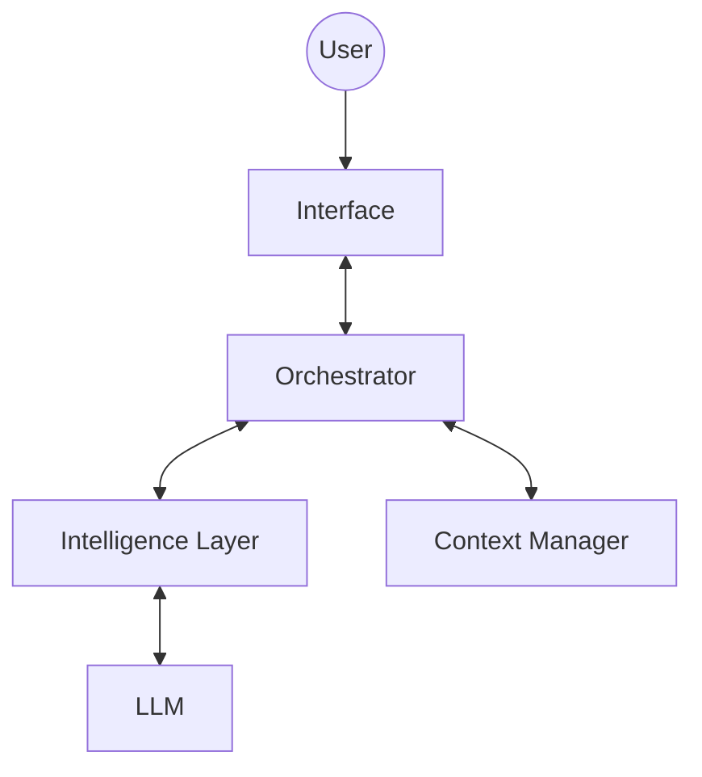

# Basic System Architecture (v1)

# Components

## Intelligence Layer

- llama.cpp (LMStudio)

## Memory Subsystem

- sqlite (relational)
- retrieve relevant information as vectors (RAG)
-> given some query, embed this query, then retrieve similar items from the database, and extract or return only the most relevant (dot product against the query vector vs. the vectors from the databse)