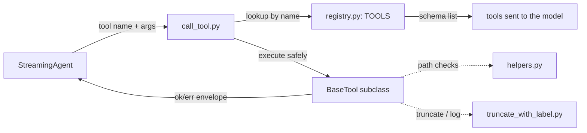

# Tools

Tools are the functions the model can call while working. This document covers how they are built, the architecture around them, and how a tool call is executed.

## Role in the agent

The agent is a turn-based loop over the OpenAI Responses API. On every turn the model is given the full tool schema in `tools` and a conversation history. If the model decides a tool is needed it emits a `function_call` item; the agent executes it in Python and feeds the result back as a `function_call_output` item, then asks the model again. That loop lives in `src/orchestrator/streaming_agent.py`.

Everything the model can call lives in `src/tools/`. There are 17 tools today, grouped by concern: filesystem, math, shell, editing, and web:

- Filesystem: `write_file`, `read_file`, `make_directory`, `list_directory`, `file_exists`, `glob`
- Math: `sqrt`, `sum`, `sub`, `mult`, `div`, `pow`, `mod`
- Shell: `shell_exec_sync`
- Editing: `file_edit_and_show_diff`
- Web: `web_search`, `web_page_scrape`

## Architecture



Four pieces, each with one job:

- `base_tool.py` — the single `BaseTool` interface every tool implements.
- `helpers.py` — shared result envelopes and path-safety logic.
- `registry.py` — instantiates every tool and derives the model-facing schemas.
- `call_tool.py` — the dispatch layer that turns a model tool call into a Python call.

Tools themselves live one file per concern (`fs.py`, `shell.py`, `ns_math.py`, `glob_tool.py`, `file_edit_and_show_diff.py`, `web_search_and_scrape.py`).

## The BaseTool interface

Every tool is a subclass of `BaseTool` and defines three metadata attributes plus an `invoke` method:

- `name` — the string the model uses to call the tool. Must be unique.
- `description` — shown to the model so it knows when to use the tool.
- `parameters` — the JSON schema describing the arguments.
- `invoke(**kwargs)` — actually performs the work and returns a result envelope.

A minimal tool looks like this:

```python
from tools.base_tool import BaseTool
from tools.helpers import ok


class UppercaseTool(BaseTool):
    name = "uppercase"
    description = "Converts a string to uppercase."
    parameters = {
        "type": "object",
        "properties": {
            "text": {"type": "string", "description": "The text to convert."},
        },
        "required": ["text"],
    }

    def invoke(self, **kwargs) -> dict:
        return ok({"converted": kwargs.get("text", "").upper()})
```

## The result contract

Every tool returns a normalized envelope with a `status` key, built with `helpers.ok` and `helpers.err`:

- Success: `{"status": "ok", "result": <payload>}`
- Error: `{"status": "error", "result": ..., "message": "why it failed"}`

The model only ever sees this one shape, which is what makes the outputs predictable. `BaseTool.run()` is the guard layer: if `invoke` raises for any reason, `run` catches it and returns an error envelope, so a buggy tool or a malformed argument can never crash the agent loop.

## Path safety

The filesystem tools share one policy in `helpers.py`:

- `BLOCKED_PATHS` — a small set of paths no tool may touch (currently shell dotfiles like `~/.bashrc`).
- `guarded_path(filepath, require_workspace=...)` — resolves the path, rejects blocked paths, and, for write operations (`require_workspace=True`), enforces that the path stays inside the configured workspace.

Read tools are allowed anywhere except blocked paths; write tools (`write_file`, `make_directory`, `file_edit_and_show_diff`) are confined to the workspace. This is why `file_edit_and_show_diff` is held to the same standards as `write_file` even though it "just edits".

## Registry

`registry.py` instantiates every tool once and exposes three things:

- `ALL_TOOLS` — every tool instance, in schema order.
- `TOOLS` — a `{name: instance}` map used for dispatch.
- `TOOL_SET` — the OpenAI schemas sent to the model, derived from each tool's `to_schema()`.

The schemas are derived from the tool classes themselves, so the schema and the implementation can never drift apart. Adding a tool means defining one class; the schema, registry entry, and dispatch all follow automatically.

## Execution flow

1. The model's `function_call` item arrives in `streaming_agent.step()`, which pushes it into context and queues it.
2. `call_tool(tool_name, tool_call_id, args)` looks the tool up in `TOOLS` by name.
3. `tool.run()` calls `invoke(**args)`, converting any exception into an error envelope.
4. The envelope is appended to context as a `function_call_output` item and the loop asks the model again.

`tool_call_id` is optional; the shell and web tools use it to name the full-output log files they write to `config.temp_path` when results are truncated (`<tool_call_id>.out`).

## Adding a new tool

1. Create a `BaseTool` subclass somewhere under `src/tools/` with `name`, `description`, `parameters`, and `invoke`.
2. Return `ok(...)` on success and `err(...)` on failure; let exceptions propagate out of `invoke` (they are caught by `run`).
3. If the tool touches the filesystem, go through `guarded_path` rather than `open()` directly.
4. Register an instance in `registry.py`.

No changes to `call_tool.py` or the schemas are needed — they are derived.
