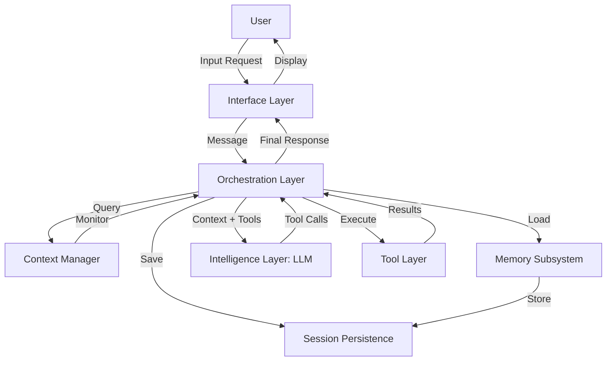

# Building a Coding Agent from Scratch with Local Vision LLMs

## A Comprehensive Guide

**Table of Contents**

1. [Introduction and Vision](#chapter-1-introduction-and-vision)
2. [System Architecture Overview](#chapter-2-system-architecture-overview)
3. [Setting Up the Local LLM with Vision](#chapter-3-setting-up-the-local-llm-with-vision)
4. [The Tool Layer Implementation](#chapter-4-the-tool-layer-implementation)
5. [Building the TUI with Textual](#chapter-5-building-the-tui-with-textual)
6. [Context Management for Long Conversations](#chapter-6-context-management-for-long-conversations)
7. [The Orchestration Loop and Tool Calling](#chapter-7-the-orchestration-loop-and-tool-calling)
8. [Session Persistence and Memory Systems](#chapter-8-session-persistence-and-memory-systems)
9. [Safety and Permission Systems](#chapter-9-safety-and-permission-systems)
10. [Practical Integration Examples](#chapter-10-practical-integration-examples)
11. [Conclusion and Next Steps](#chapter-11-conclusion-and-next-steps)

---

# Chapter 1: Introduction and Vision

## Welcome to Your Coding Agent Journey

Building a coding agent that operates like Claude Code, OpenCode, or aider represents one of the most exciting frontiers in practical artificial intelligence. This guide will walk you through the complete process of constructing such a system from the ground up, using a local large language model with vision capabilities. You will learn not just what components are needed, but why they matter and how they fit together to create an agent that can autonomously edit files, execute shell commands, navigate codebases, and collaborate with you through an interactive terminal interface.

The vision for this project is ambitious yet achievable: a local, privacy-preserving coding assistant that runs entirely on your hardware, capable of understanding both text and images, and empowered with the tools to actually modify your projects. Unlike cloud-based alternatives, a local agent keeps your code private, works without internet connectivity once set up, and can be customized to your exact workflow preferences. The addition of vision capabilities means it can analyze screenshots of errors, understand diagrams, read code from images, and assist with visual debugging tasks that pure text models cannot handle.

When you complete this build, you will have created a system where you can simply describe what you want to accomplish—whether it is refactoring a complex module, fixing a bug identified in a screenshot, or writing tests for a new feature—and the agent will break down the task, plan its approach, execute the necessary file edits and commands, and report back on its progress. The agent will maintain context across long conversations, remember the state of your project between sessions, and learn from your feedback. It will show you diffs before making changes, ask for confirmation on destructive operations, and provide transparency into its decision-making process.

This capability transforms how you interact with your code. Instead of manually navigating files, making edits, running tests, and debugging errors, you can engage in a conversation with an intelligent partner that understands your codebase and executes your intentions. The agent becomes an extension of your own problem-solving abilities, handling the tedious work of implementation while you focus on high-level design and architecture decisions. For long-term projects like writing an operating system or building a large application, the agent can maintain continuity across days or weeks of work, remembering what it did yesterday, what tests it ran, and what issues it encountered.

The technology stack we will use prioritizes Python for its excellent ecosystem and readability, local LLM inference through Ollama for ease of setup, and Textual for a modern terminal user interface. These choices balance power, flexibility, and accessibility. Python has mature libraries for every task we need—from file manipulation to HTTP requests to syntax highlighting. Ollama provides a simple way to run quantized models locally with an OpenAI-compatible API. Textual delivers a rich terminal experience that feels modern while remaining accessible through any terminal emulator. Together, they form a foundation that can scale from a minimal prototype to a production-quality tool.

Throughout this guide, I will emphasize practical implementation over theoretical discussion. Every concept is accompanied by working code examples that you can adapt and extend. I will explain the trade-offs between different approaches, such as when to use unified diffs versus search-and-replace editing, or why you might choose Ollama over llama.cpp. You will learn not just how to make something work, but how to make it work well—considering performance, reliability, security, and user experience. The goal is to give you both the immediate ability to build a functioning agent and the deeper understanding to iterate and improve it based on your specific needs.

The journey ahead is substantial but structured. We will begin by examining the overall architecture and understanding how all the pieces fit together. Then we will dive into each component: setting up the local LLM, implementing the tool layer for file and command operations, building the terminal interface, managing context for long conversations, and orchestrating everything through a tool-calling loop. Along the way, I will reference real-world coding agents like Aider and Claude Code to show you how professionals have solved similar problems. We will also address important considerations like safety, error handling, and session persistence that distinguish a toy prototype from a tool you can trust with real projects.

By the end of this guide, you will have a complete, working coding agent that you can deploy on your development machine. You will understand the design decisions behind each component and have the knowledge to extend it with additional features. More importantly, you will have the foundation for experimenting with different models, tools, and interaction patterns as the technology continues to evolve. The landscape of local AI is moving rapidly, with new models and capabilities emerging constantly. The principles we establish here will remain valuable even as specific tools and techniques advance.

Before we begin, let me address a few practical considerations. Building a local coding agent requires adequate hardware—specifically a GPU with at least 12 gigabytes of VRAM to run capable 7-billion parameter models at reasonable speeds. If your hardware is limited, you can still build the system and use smaller models or CPU inference, understanding that performance will be slower. Privacy is a benefit but also a responsibility: running locally means you are responsible for securing your system and the tools your agent executes. Safety mechanisms and permission systems are essential to prevent accidental data loss or system damage. I will cover these topics in detail as we progress.

The research that informs this guide draws from multiple sources. I have studied the architectures of leading open-source coding agents, analyzed benchmark results for different file editing strategies, tested local vision models on coding tasks, and implemented prototypes to validate the approaches described here. Where applicable, I will provide citations to primary sources so you can explore topics in greater depth. This is a synthesis of current best practices, adapted for practical implementation in a local environment. Some choices reflect trade-offs that may differ based on your priorities—for example, maximum performance versus ease of setup—or your constraints, such as available hardware or acceptable latency.

As you read through this guide, I encourage you to build incrementally. Do not try to implement everything at once. Start with the simplest working version: a text-only model, basic file reading and writing, and a simple command line interface. Get that working end-to-end before adding vision capabilities or a full terminal user interface. Each component adds complexity, and it is easier to debug and understand the system when you build it up piece by piece. The comprehensive architecture described in later chapters can seem daunting, but you do not need to implement it all in one sitting. The minimum viable agent is surprisingly small, and you can add features as you identify your specific needs.

With that overview complete, let us begin by examining the high-level architecture that will guide our implementation. Understanding how the components interact at a system level will provide context for the detailed work that follows. The architecture is not just a diagram but a set of design decisions that shape every aspect of the implementation, from the API choices we make to the file formats we use for persistence. By establishing this foundation early, we ensure that each component we build serves a clear purpose within the larger system.

---

# Chapter 2: System Architecture Overview

## Understanding the Complete System

Before diving into implementation details, it is essential to understand how all the components of a coding agent fit together. The architecture we will build follows a clean layered design where each layer has a specific responsibility and communicates with other layers through well-defined interfaces. This separation of concerns makes the system easier to understand, test, and extend. In this chapter, I will describe each major component, explain how they interact, and provide a mental model for the data flow through the system.

At the highest level, our coding agent consists of four primary layers. The user interface layer handles all interaction with the human user through a terminal-based chat interface. The orchestration layer manages the agent's decision-making process, including the main loop that decides when to call tools and when to respond directly. The tool layer provides the actual capabilities for file operations, shell commands, git operations, and web search. The intelligence layer consists of the local language model that processes messages and generates responses, tool calls, and code edits. These layers are connected through supporting components: a context manager that maintains conversation history and token budgets, a session persistence system that saves state between runs, and a memory subsystem that stores long-term learnings about projects and user preferences.

The data flow through this architecture follows a predictable pattern. The user enters a request through the terminal interface, which passes it to the orchestration layer. The orchestration layer adds the user message to the conversation history managed by the context manager. It then formats the complete context—including the system prompt, conversation history, available tool descriptions, and any relevant repository information—and sends it to the intelligence layer. The language model processes this context and generates a response, which may be a direct answer or a request to execute one or more tools. If tools are required, the orchestration layer extracts the tool calls from the model's response, executes them through the tool layer, and feeds the results back to the model. This loop continues until the model produces a final response, which is then formatted and displayed to the user through the interface layer. Throughout this process, the context manager monitors token usage and applies compaction strategies as needed to stay within budget, while the session persistence layer saves important state to disk.

Let me describe each component in more detail, starting with the intelligence layer. This is the heart of the system: a locally hosted large language model with vision capabilities. The model runs through an inference server such as Ollama or llama.cpp, which exposes an API compatible with the OpenAI chat completions interface. This compatibility is important because it means we can write our code once and switch between different model providers or inference backends with minimal changes. The model itself is chosen based on the trade-off between capability and resource requirements. For a system running on consumer hardware with a 12 to 16 gigabyte GPU, a 7 billion parameter model like Qwen2.5-VL or LLaVA-NeXT offers excellent performance. These models have been quantized to reduce memory footprint while maintaining accuracy. The vision capability comes from an additional visual encoder that processes images and converts them into embeddings that the language model can understand alongside text tokens.

The tool layer is where the agent gains its ability to actually affect the world. Without tools, the model can only discuss code without being able to read or modify it. The tool layer exposes a set of functions that the agent can invoke, each with a well-defined interface and clear success or failure reporting. Core tools include reading and writing files, executing shell commands within safe boundaries, performing git operations like staging changes and creating commits, searching the file system, and querying web APIs for information. Each tool implements validation and error handling to ensure safe operation. For example, file write operations might create backups before making changes and verify the new file has valid syntax before committing. Shell command execution runs with timeouts and output capture to prevent hanging or flooding the context window. The tool layer also includes a registry that maps tool names to their implementations and generates the schemas that are sent to the language model, describing what each tool does and what parameters it accepts.

The orchestration layer implements the main agent loop that coordinates everything. This is where the magic of autonomous operation happens. The loop begins by taking the current conversation state and asking the language model what it should do next. The model responds with either a direct answer or a tool call request. If it is a tool call, the orchestrator extracts the tool name and parameters, validates them for basic correctness, executes the tool, and prepares the result for the model. The result is formatted as a tool response message and appended to the conversation. The loop then asks the model again, now with the tool results available as context. This iterative process continues until the model produces a final answer that does not require any tool calls. The orchestrator is also responsible for handling errors, implementing retry logic, enforcing safety policies, and managing the flow control between the user interface and the model. It maintains the state machine of the conversation and ensures that all messages are properly ordered and complete.

The context manager is a critical component that often receives insufficient attention but determines whether the agent can handle long conversations effectively. Language models have finite context windows—typically between 8,000 and 128,000 tokens depending on the model. A conversation with a model that is working on a complex coding task can easily exceed these limits if not managed carefully. The context manager tracks token usage in real time, using libraries like tiktoken to count tokens accurately rather than estimating. When usage approaches the model's limit, it applies compaction strategies. The simplest strategy is a sliding window that keeps only the most recent turns of conversation. A more sophisticated approach uses head-tail compaction, preserving the initial system prompt and the most recent messages while discarding older conversation history. For very long sessions, the context manager can generate summaries of older conversations and insert them as condensed context. All these strategies are configurable so that users can tune the balance between context richness and token economy.

Session persistence ensures that the agent can resume work after being shut down or restarting. When you close a coding agent session and start a new one later, you want to pick up where you left off. The persistence layer saves the conversation history to disk in a structured format like JSON, along with any metadata about the current task, the files that were modified, and the state of pending operations. On startup, the agent loads this saved state and reconstructs the conversation context so the model can continue seamlessly. The persistence layer also maintains a log of all tool executions, allowing users to review what actions were taken and why. This is valuable for debugging and for learning from past sessions. Some agents, like Aider, integrate with git for persistence by creating commits after each major change, but we will use a file-based approach that is simpler to implement and debug.

The memory subsystem stores information that should persist across multiple sessions and projects. While session persistence maintains the state of a single conversation, memory captures longer-term learnings. For example, the agent might learn that you prefer certain coding patterns, that you have a specific project structure you like to use, or that you always want tests to run after code changes. This information is stored in a compact form that can be retrieved and injected into the context when relevant. The memory system uses semantic search to find the most relevant memories for a given query, or you can implement a simpler key-value store for explicitly tagged information. In the implementation we will build, memory is stored as text files in a dedicated directory, with each file representing a memory entry. This makes memories human-readable and easy to manage manually if needed. The memory subsystem also integrates with the context manager to include relevant memories in the system prompt.

Now let me describe how these components interact through the main agent loop. When the user submits a request, the interface layer captures the input and passes it to the orchestrator. The orchestrator first checks the context manager to determine the current token budget and whether any memory needs to be loaded for this request. It then constructs the complete message sequence: the system prompt describing the agent's role and capabilities, any relevant memories, the accumulated conversation history, and the new user message. This sequence is sent to the language model through the inference API, along with the tool schemas that describe what actions the agent can take. The model processes this input and generates a response, which the orchestrator parses to determine if tool calls are required.

If the model produces tool calls, the orchestrator iterates through each call. For every tool invocation, it extracts the tool name and parameters, looks up the implementation in the tool registry, and executes it. The tool returns a result indicating success or failure, along with any output or error messages. The orchestrator formats this result into a tool response message and appends it to the conversation history. After all tool calls are processed, the orchestrator sends the updated conversation back to the model and waits for a new response. This loop continues until the model responds without tool calls, at which point the orchestrator considers the task complete.

Once a final response is received, the orchestrator passes it to the interface layer for display. Before displaying, the interface might apply formatting—highlighting code blocks in different colors, showing diffs with color-coded additions and deletions, or rendering command output in a scrollable panel. The user can then provide feedback, ask for changes, or submit a new request, and the cycle begins again. Throughout this process, the context manager monitors token usage and triggers compaction if necessary. The session persistence layer saves periodic checkpoints so that the conversation state is not lost if the program crashes. And the memory subsystem may store any learnings that emerge from the interaction.

This architecture is designed to be modular so that components can be swapped or upgraded independently. You might start with a simple text-only model and later upgrade to a vision-capable model without changing the tool layer. You could replace the Textual interface with a web interface or IDE plugin without affecting the orchestration logic. The tool layer can be extended with new capabilities without modifying the core loop. This flexibility is important because the field is evolving rapidly, and you will want to experiment with different models, tools, and interfaces as they become available.

The following diagram illustrates the architecture using a Mermaid flowchart, which you can render in any Markdown viewer that supports the format:



This architecture scales from minimal to comprehensive. The minimal version includes just the orchestrator, a basic tool set, a simple interface, and direct model access. You can add context management, memory, and advanced tooling incrementally as you identify needs. The architecture also supports multiple agents working together, as in Claude Code's multi-agent architecture or Aider's three-tier model system where different models handle planning, editing, and assistant tasks. For the scope of this guide, I will focus on a single-agent design that you can later extend if needed.

With this architectural understanding in place, we are ready to begin implementation. The next chapter covers setting up the local language model with vision capabilities, which forms the foundation for everything that follows. Once the model is running, we will build the tool layer, then the interface, and finally tie everything together with the orchestration loop. Each chapter will include working code examples that you can test and adapt as you build your own agent.

---

# Chapter 3: Setting Up the Local LLM with Vision

## Choosing and Deploying Your Foundation Model

The language model is the intelligence core of your coding agent. Choosing the right model and setting it up correctly determines not just what your agent can do, but how well it does it. In this chapter, I will guide you through selecting an appropriate vision-capable model for your hardware, installing the inference backend, and configuring everything for optimal performance. We will cover both the quick-start path using Ollama for immediate testing and the more production-oriented options like llama.cpp and vLLM for maximum efficiency.

Before making any decisions, you need to understand the relationship between model capability and hardware requirements. Vision-capable models are larger than text-only models because they include a visual encoder alongside the language model. A 7 billion parameter model with vision capabilities typically requires between 8 and 12 gigabytes of VRAM when quantized to 4-bit precision, which is the sweet spot for balancing quality and resource usage. If you have an NVIDIA RTX 3060 with 12 gigabytes of VRAM or better, you can run models in this category at reasonable speeds. The RTX 4060 Ti with 16 gigabytes opens up the possibility of running 13 billion parameter models or larger quantizations of 7 billion models with slightly better quality. If you have an RTX 3090 or 4090 with 24 gigabytes of VRAM, you can run even the most capable local models including 34 billion parameter variants or full precision 7 billion models.

For the specific models, I recommend the Qwen2.5-VL series or Qwen3-VL series as your starting point. These models have demonstrated strong performance on coding-related visual tasks and offer context windows large enough to handle substantial conversations and code files. The Qwen2.5-VL 7B variant provides a 128,000 token context window, which means you can feed entire source files or long conversations into the model without worrying about overflow. The newer Qwen3-VL 8B expands this to 256,000 tokens and adds native tool calling support, which simplifies the integration with your agent's tool layer. Both models have strong code understanding capabilities that exceed general-purpose vision models like LLaVA, which is why they are my recommendation for a coding agent rather than a generic multimodal assistant.

Alternative models worth considering include the LLaVA family, particularly LLaVA-NeXT with Llama-3 backbone and 8 billion parameters. LLaVA models are well-documented, widely tested, and have excellent community support. They tend to be more capable at general visual reasoning than the Qwen models but slightly weaker on code-specific tasks. If your agent will spend significant time analyzing diagrams, screenshots of UI elements, or other non-code visual content, LLaVA might be the better choice. The trade-off is that LLaVA models have smaller context windows, typically 8,000 to 32,000 tokens, which means you need to be more aggressive with context management for long coding sessions.

Let me now walk through the setup process for each inference backend, starting with Ollama, which offers the smoothest path to a working system. Ollama is a cross-platform tool that simplifies the deployment of local LLMs. It handles model downloads, manages the inference server, and provides a simple API that is compatible with the OpenAI chat completions format. This compatibility is crucial because it means the rest of your agent code does not need to change if you decide to switch to a different inference backend later. The installation process varies by platform but is straightforward in all cases.

On Linux, you install Ollama by running a single shell command. Open your terminal and execute the curl command that downloads and runs the Ollama installation script. The script creates a system service that runs Ollama in the background, making it available on localhost at port 11434. On macOS, you can use Homebrew to install Ollama or download the graphical application from the Ollama website. The macOS version runs as a background application and appears in your menu bar, giving you control over when the inference server is active. Windows users download the installer from the Ollama website and run it like any other Windows application. In all cases, after installation, you verify that Ollama is running by checking if the local server is responding to requests.

Once Ollama is installed and running, you need to pull the model you want to use. The pull command downloads the model weights and configures Ollama to serve them. For the Qwen2.5-VL 7B model, the command is simple: type ollama pull qwen2.5vl:7b in your terminal. Ollama will display progress as it downloads the model, which for a 7 billion parameter model might take several minutes depending on your internet connection. Once the download completes, the model is available for use. You can also pull the LLaVA model by running ollama pull llava, which will download a different vision model. I recommend pulling both models initially so you can compare their capabilities on your specific tasks.

Testing that your model works correctly is an important step before integrating it with your agent. Ollama provides a command-line interface for interactive testing. Run ollama run qwen2.5vl:7b to start an interactive session with the model. You can then ask questions, give instructions, or provide images for analysis. For example, you might type describe this image and then provide a file path to an image on your system. The model will respond with its analysis. You can also test tool calling capabilities if you are using a model that supports it, like Qwen3-VL. The command-line testing helps you verify that the model responds correctly, that image analysis works, and that you are comfortable with the model's behavior before committing to it for your agent.

For programmatic access, Ollama provides both a native Python client and an OpenAI-compatible API. The native client is simpler to use for Ollama-specific features like streaming responses and tool calls. You install the client library with pip install ollama and then import the chat function from the library. The chat function takes a model name and a list of messages, where each message has a role and content. For vision-capable models, you include an images key with file paths or base64-encoded image data. The response contains the model's generated content in a structured format that is easy to parse. This client library is well-maintained and handles connection management, error retries, and response parsing for you.

The OpenAI-compatible API is useful because many existing code examples and libraries expect the OpenAI format. Ollama exposes this API at http://localhost:11434/v1, which you can access using the standard OpenAI Python client. You create an OpenAI client instance with a custom base URL pointing to Ollama and use it like any OpenAI client. The messages format is the same as Ollama's native format: a list of dictionaries with role and content keys. For images, you use the content array format with type and text or image_url fields. This compatibility means you can swap Ollama into code that was originally written for OpenAI's API with minimal changes.

For more advanced users or production deployments, llama.cpp offers better performance and more control. llama.cpp is a C++ library optimized for efficient inference, with Python bindings available through the llama-cpp-python package. The library uses GGUF format models, which are quantized versions of models designed for efficient CPU and GPU inference. The quantization process reduces the precision of model weights, trading a small amount of accuracy for significant gains in speed and memory efficiency. llama.cpp supports multiple quantization levels, allowing you to choose the balance that works for your hardware.

To use llama.cpp with vision models, you need to download both the language model in GGUF format and a multimodal projection file, often called mmproj. The mmproj file contains the weights for the visual encoder that processes images. You can find both files on HuggingFace by searching for the model name followed by GGUF. For example, searching for llava-v1.5-7b-GGUF will bring up repositories containing the language model and projection files in various quantization levels. Download both files to a local directory, then initialize the llama-cpp-python client with paths to both files. The client supports chat completion requests with images encoded as base64 strings, similar to the OpenAI format.

The setup process for llama.cpp is more involved than Ollama because you need to handle model files and configuration manually. However, the benefits are worth the extra effort if you need maximum performance. llama.cpp can be faster than Ollama for the same model because it is more aggressively optimized for inference. It also supports CPU-only inference, which means you can run models even without a GPU, albeit at slower speeds. The library has extensive options for controlling inference parameters like context size, batch size, and GPU offloading, which allows fine-tuning for your specific use case.

Configuration tuning is an important part of the setup process. Most inference backends expose parameters that control model behavior. The temperature parameter affects how deterministic the model's responses are. Lower temperatures make the model more consistent and focused, which is usually desirable for coding tasks where accuracy matters more than creativity. Higher temperatures introduce more variation, which might be useful for brainstorming or generating multiple solution options. Top-p sampling controls the diversity of generated tokens by considering only the cumulative probability mass of the top tokens. A value around 0.9 works well for most tasks. The context window size determines how much conversation history and code context the model can consider at once. For vision models, remember that images consume a significant portion of the context window, so you may need to reduce the effective text context.

For coding agents specifically, you want to configure the model to produce structured output when making tool calls. Some models like Qwen3-VL have native tool calling support that outputs tool calls in a specific format. Others require you to instruct them to output JSON when calling tools. The system prompt plays a crucial role here: you must clearly describe the tools available to the agent and the format in which tool calls should be made. This prompt engineering is part art and part science, and it often requires iteration to get right for a particular model. I will cover detailed examples of tool calling prompts in a later chapter, but the basic principle is to be explicit and consistent in your instructions.

Vision-specific configuration is also important. You need to decide how to handle image resolution and preprocessing. Higher resolution images provide more detail but consume more tokens and take longer to process. Many vision models have built-in dynamic resolution support that adjusts the image encoding based on the aspect ratio and content complexity. For the best results, resize images to a square or near-square aspect ratio before sending them to the model, as most vision encoders expect square inputs. You might also want to compress images to reduce file size and processing time, especially if you are working with screenshots that are already at reasonable quality.

Error handling and monitoring round out the setup considerations. Inference servers can fail for various reasons: running out of VRAM, network timeouts, or malformed requests. Your agent code should catch these errors gracefully and provide informative feedback to the user. Implement retry logic with exponential backoff to handle transient failures. Monitor inference latency and token counts to detect when the system is under stress. Some inference backends expose metrics endpoints that you can query for performance data. For debugging, log all requests and responses during development so you can analyze failures and model behavior after the fact.

With the inference backend configured and tested, you have the foundation for your coding agent. The next steps involve building the tool layer that gives the agent capabilities beyond chat, implementing the user interface that makes interaction pleasant and productive, and connecting everything together through the orchestration loop. Each of these components depends on the reliable operation of the model, so take the time to ensure your setup is solid before moving forward. If you encounter issues during setup, the Ollama and llama.cpp communities are active and helpful, with many resources available online for troubleshooting common problems.

As a final practical note, document your setup configuration in a file that travels with your project. Record which model you are using, which inference backend, what parameters you have configured, and any workarounds you have discovered. This documentation will be invaluable when you share your agent with others, when you need to recreate the environment on a different machine, or when the model or backend versions are updated and you need to debug compatibility issues. A simple configuration file in JSON or YAML format works well for this purpose, with sections for model settings, backend settings, and any custom configurations you have developed.

The work in this chapter establishes the intelligence layer of your agent. Once you have a working model that responds correctly to text and image inputs, you can begin building the capabilities that transform it from a chatbot into an agent that takes action. The remaining chapters will guide you through constructing those capabilities, layer by layer, until you have a complete system that you can deploy and use for real coding tasks. Take pride in this foundation: a well-configured model is the single most important factor in the overall quality of your agent's performance.

---

# Chapter 4: The Tool Layer Implementation

## Giving Your Agent the Ability to Take Action

A language model without tools is like a brilliant mind with no hands—it can understand and plan but cannot affect the world. The tool layer bridges this gap by exposing functions that the agent can invoke to read and modify files, execute shell commands, interact with the file system, and access external information. In this chapter, I will detail the design and implementation of each core tool, emphasizing safety, reliability, and the specific patterns that make tools effective for coding tasks. You will learn not just how to implement these tools, but how to implement them well, with validation, error handling, and user feedback built in from the start.

The foundation of the tool layer is the file system interface. Your agent needs to be able to read files, write files, list directories, and move or delete files when necessary. These operations seem straightforward, but they are where many coding agents stumble because they neglect important details. A simple read operation must handle encoding issues, large files, and binary files gracefully. A write operation must create backup copies before overwriting existing files, validate that the new content is reasonable, and ensure atomic writes to prevent data loss if the process crashes mid-write. A delete operation should be protected by confirmation checks and preferably use a trash or archive mechanism rather than permanent deletion.

Let me start with the file read operation, which is the most common tool your agent will use. When reading a file for the agent's context, you need to consider the file size and content type. Code files are typically text and can be read with UTF-8 encoding, but you should handle encoding errors gracefully by attempting multiple encodings or falling back to a representation that preserves the bytes without decoding. For large files, you might want to read only the first portion and last portion of the file to give the agent context without consuming excessive tokens, or implement intelligent truncation that keeps function definitions and removes middle sections. The file read tool should return not just the content but also metadata like the file path, file size, line count, and a snippet of the first few lines to help the agent determine if this is the right file.

Here is a concrete implementation of a robust file read function that handles these concerns:

```python
from pathlib import Path
from typing import Optional, Dict, Any

def read_file(file_path: str, max_lines: Optional[int] = None) -> Dict[str, Any]:
    """
    Read a file with safety checks and metadata.
    
    Args:
        file_path: Path to the file to read
        max_lines: Optional maximum number of lines to return
    
    Returns:
        Dictionary with content, metadata, and status
    """
    path = Path(file_path)
    
    # Validate that the file exists and is within allowed directories
    if not path.exists():
        return {
            "success": False,
            "error": f"File not found: {file_path}",
            "content": None
        }
    
    if not path.is_file():
        return {
            "success": False,
            "error": f"Path is not a file: {file_path}",
            "content": None
        }
    
    # Read with encoding fallback
    content = None
    for encoding in ['utf-8', 'latin-1', 'cp1252']:
        try:
            content = path.read_text(encoding=encoding)
            break
        except UnicodeDecodeError:
            continue
    
    if content is None:
        return {
            "success": False,
            "error": f"Could not decode file: {file_path}",
            "content": None
        }
    
    # Handle line limiting
    lines = content.splitlines()
    if max_lines and len(lines) > max_lines:
        # Keep first and last portions
        half = max_lines // 2
        truncated_lines = lines[:half] + [f"... ({len(lines) - max_lines} lines omitted) ..."] + lines[-half:]
        content = "\n".join(truncated_lines)
    
    return {
        "success": True,
        "content": content,
        "metadata": {
            "path": str(path.absolute()),
            "size_bytes": path.stat().st_size,
            "line_count": len(lines),
            "encoding": encoding
        }
    }
```

This implementation includes error handling, encoding fallback, optional truncation, and metadata about the file. The agent can use this metadata to decide whether to request the full file or work with the truncated version.

The file write operation requires more care because it can destroy data if something goes wrong. A safe file write should follow this pattern: first, create a backup of the existing file if it exists. Second, write the new content to a temporary file in the same directory. Third, verify the temporary file has the expected content. Fourth, atomically rename the temporary file to the target path. This pattern ensures that if anything fails during the write, the original file is preserved. Many systems support atomic rename operations at the operating system level, which means the rename either completes entirely or does not happen at all, preventing partial writes.

Beyond the basic safety measures, a file write tool for a coding agent should support content validation. Before overwriting a code file, the agent might want to verify that the new content is syntactically valid. For Python files, this means parsing the content and checking for syntax errors. For other languages, you might use language-specific linters or compilers. This validation prevents the agent from accidentally breaking code files, which would require manual intervention to fix. The write operation should also support dry-run mode, where the tool simulates the write without actually changing any files, allowing the agent and user to review the changes before committing them.

The search-and-replace editing pattern is one of the most powerful tools for a coding agent because it allows precise modifications without rewriting entire files. Unlike a simple write operation that replaces the entire file content, search-and-replace finds a specific text pattern and replaces it with new text. This approach is more efficient in terms of tokens, more precise in its changes, and easier to review in a diff format. The implementation challenge is ensuring that the search pattern matches exactly what is in the file, and that the replacement does not introduce unintended side effects.

A robust search-and-replace implementation should handle multiple matches, optionally limiting the number of replacements. It should report exactly what was changed, including the line numbers and the old and new content. Before making the replacement, it should validate that the search pattern exists and that the replacement produces valid content. Here is an implementation that includes these features:

```python
import re
from pathlib import Path
from typing import Optional, List, Tuple

class EditResult:
    """Result of a file edit operation."""
    def __init__(self, success: bool, changes: int, error: Optional[str] = None):
        self.success = success
        self.changes = changes
        self.error = error

def search_and_replace(
    file_path: str,
    search: str,
    replace: str,
    max_count: Optional[int] = None,
    create_backup: bool = True
) -> EditResult:
    """
    Perform search-and-replace on a file.
    
    Args:
        file_path: Path to the file to edit
        search: Text pattern to search for
        replace: Text to replace matches with
        max_count: Maximum number of replacements (None for unlimited)
        create_backup: Whether to create a backup before editing
    
    Returns:
        EditResult with success status and number of changes
    """
    path = Path(file_path)
    
    if not path.exists():
        return EditResult(success=False, changes=0, error=f"File not found: {file_path}")
    
    # Read original content
    try:
        original = path.read_text(encoding='utf-8')
    except Exception as e:
        return EditResult(success=False, changes=0, error=f"Could not read file: {e}")
    
    # Check if search pattern exists
    if search not in original:
        return EditResult(success=False, changes=0, error=f"Search pattern not found in file")
    
    # Create backup if requested
    if create_backup:
        backup_path = path.with_suffix(path.suffix + '.bak')
        backup_path.write_text(original, encoding='utf-8')
    
    # Perform replacement
    count = 0
    if max_count:
        new_content, count = re.subn(re.escape(search), replace, original, count=max_count)
    else:
        new_content, count = re.subn(re.escape(search), replace, original)
    
    if count == 0:
        # Restore backup if it exists
        if create_backup and backup_path.exists():
            backup_path.unlink()
        return EditResult(success=False, changes=0, error="No matches found")
    
    # Write new content
    try:
        path.write_text(new_content, encoding='utf-8')
    except Exception as e:
        # Restore backup on failure
        if create_backup and backup_path.exists():
            path.write_text(backup_path.read_text(), encoding='utf-8')
            backup_path.unlink()
        return EditResult(success=False, changes=0, error=f"Could not write file: {e}")
    
    return EditResult(success=True, changes=count)
```

This implementation creates backups, handles errors gracefully, and reports exactly what was changed. The agent can use the change count to verify that the expected number of replacements occurred.

Unified diff generation and application is another critical tool pattern that supports more complex edits. Unified diffs are the standard format used by version control systems like git and by tools like patch. They describe changes in a compact, human-readable format that shows context lines around modified regions. Generating a unified diff from two versions of a file is straightforward using Python's difflib module. Applying a unified diff to a file requires parsing the diff format and executing the insertions and deletions at the correct line positions.

The advantage of using unified diffs for file editing is that they are reversible and explicit. The agent can show the user a diff before making changes, and if something goes wrong during application, the diff can be re-applied to restore the original state. The unidiff library provides a convenient interface for parsing and applying unified diffs. It handles edge cases like partial matches and context verification.

Here is how you would generate a unified diff between two versions of a file:

```python
import difflib
from typing import List

def generate_unified_diff(
    original_lines: List[str],
    modified_lines: List[str],
    from_file: str = "original",
    to_file: str = "modified",
    context_lines: int = 3
) -> str:
    """
    Generate a unified diff string between two file versions.
    
    Args:
        original_lines: Lines of the original file
        modified_lines: Lines of the modified file
        from_file: Label for the original file in diff header
        to_file: Label for the modified file in diff header
        context_lines: Number of context lines around changes
    
    Returns:
        Unified diff as a string
    """
    diff = difflib.unified_diff(
        original_lines,
        modified_lines,
        fromfile=from_file,
        tofile=to_file,
        n=context_lines,
        lineterm=''
    )
    return '\n'.join(diff)
```

And here is how you would apply a unified diff to a file using the unidiff library:

```python
from unidiff import PatchSet
from pathlib import Path

def apply_patch(file_path: str, patch: str) -> Tuple[bool, Optional[str]]:
    """
    Apply a unified diff patch to a file.
    
    Args:
        file_path: Path to the file to patch
        patch: Unified diff string
    
    Returns:
        Tuple of (success, error_message)
    """
    try:
        # Read original content
        original = Path(file_path).read_text(encoding='utf-8')
        original_lines = original.splitlines(keepends=True)
        
        # Parse patch
        patch_set = PatchSet(patch)
        
        if len(patch_set) == 0:
            return False, "No patches found in patch string"
        
        # Apply first patch (assume single file)
        patched_file = patch_set[0]
        
        # Apply hunk by hunk in reverse order to preserve line numbers
        lines = original_lines.copy()
        for hunk in reversed(patched_file):
            start_line = hunk.source_start - 1  # Convert to 0-indexed
            
            # Verify context
            context_start = start_line
            context_end = start_line + hunk.source_length
            
            if context_end > len(lines):
                return False, f"Hunk out of bounds: {hunk.source_start}"
            
            # Apply hunk
            del lines[context_start:context_end]
            for i, line in enumerate(hunk.target_lines):
                lines.insert(context_start + i, line)
        
        # Write patched content
        Path(file_path).write_text(''.join(lines), encoding='utf-8')
        
        return True, None
        
    except Exception as e:
        return False, f"Patch application failed: {e}"
```

This patch application is more sophisticated than simple search-and-replace because it preserves line numbers and handles multiple changes in a single patch. The reverse iteration through hunks ensures that line numbers remain accurate as deletions and insertions modify the file.

Shell command execution is another essential tool for a coding agent, but it requires careful safety measures. The agent should be able to run build commands, test suites, linters, and other development tools through the shell. However, unrestricted shell execution is dangerous because the agent could accidentally delete important files, modify system configuration, or execute malicious code from the internet. The solution is to sandbox shell execution with timeouts, output capture, and command restrictions.

A safe shell execution tool should have the following features: command validation to prevent dangerous commands, timeout limits to prevent hanging, output capture with size limits to prevent flooding the context, and a working directory restriction to keep execution within the project. You should also consider running commands in a virtual environment or container to isolate them from the host system.

```python
import subprocess
import shlex
from pathlib import Path
from typing import Optional, Tuple

def safe_shell_command(
    command: str,
    working_dir: str,
    timeout: int = 60,
    max_output_lines: int = 200,
    allowed_commands: Optional[list] = None
) -> Tuple[bool, str, Optional[str]]:
    """
    Execute a shell command safely with validation and limits.
    
    Args:
        command: Shell command to execute
        working_dir: Working directory for the command
        timeout: Maximum execution time in seconds
        max_output_lines: Maximum lines of output to capture
        allowed_commands: Optional list of allowed commands
    
    Returns:
        Tuple of (success, output, error)
    """
    # Validate command
    if allowed_commands:
        first_word = command.split()[0] if command else ''
        if first_word not in allowed_commands:
            return False, "", f"Command '{first_word}' is not allowed"
    
    # Validate working directory
    work_dir = Path(working_dir)
    if not work_dir.exists() or not work_dir.is_dir():
        return False, "", f"Working directory does not exist: {working_dir}"
    
    # Block dangerous commands
    dangerous_patterns = ['rm -rf /', 'mkfs', 'dd if=', '> /dev/', 'chmod 777']
    for pattern in dangerous_patterns:
        if pattern in command:
            return False, "", f"Potentially dangerous command blocked: {pattern}"
    
    try:
        # Execute command
        result = subprocess.run(
            shlex.split(command),
            cwd=str(work_dir),
            capture_output=True,
            text=True,
            timeout=timeout,
            shell=False  # Use shell=False for safety
        )
        
        # Truncate output
        stdout_lines = result.stdout.splitlines()
        if len(stdout_lines) > max_output_lines:
            stdout = '\n'.join(stdout_lines[:max_output_lines//2]) + f'\n... ({len(stdout_lines) - max_output_lines} lines truncated) ...\n' + '\n'.join(stdout_lines[-max_output_lines//2:])
        else:
            stdout = result.stdout
        
        stderr = result.stderr
        
        success = result.returncode == 0
        return success, stdout, stderr if stderr else None
        
    except subprocess.TimeoutExpired:
        return False, "", f"Command timed out after {timeout} seconds"
    except Exception as e:
        return False, "", f"Command execution failed: {e}"
```

This implementation includes command validation, dangerous pattern blocking, timeout protection, and output truncation. The agent should be configured with an allowlist of commands appropriate for the project, such as pytest, npm test, make, git, and similar development tools.

Git integration is particularly valuable for a coding agent because it provides a natural way to track and undo changes. Every file modification can be staged and committed, creating a historical record that the agent and user can review. Git operations should be implemented as tools just like file edits, with proper error handling and output reporting. Common git tools include status (show modified files), diff (show changes), add (stage files), commit (create commit with message), and reset (undo changes).

The git status tool is especially useful for giving the agent context about what changes exist. When the agent starts a new task, checking git status reveals whether there are uncommitted changes that might interfere with the task. The git diff tool shows the actual content changes, which the agent can analyze to understand what the user has done or what the agent previously changed.

```python
import subprocess
from pathlib import Path
from typing import Optional, Tuple

def git_command(repo_path: str, args: list) -> Tuple[bool, str, Optional[str]]:
    """
    Execute a git command with proper error handling.
    
    Args:
        repo_path: Path to the git repository
        args: List of git command arguments
    
    Returns:
        Tuple of (success, output, error)
    """
    try:
        result = subprocess.run(
            ['git'] + args,
            cwd=repo_path,
            capture_output=True,
            text=True,
            timeout=30
        )
        
        success = result.returncode == 0
        return success, result.stdout, result.stderr if result.stderr else None
        
    except Exception as e:
        return False, "", f"Git command failed: {e}"

def git_status(repo_path: str) -> Tuple[bool, str, Optional[str]]:
    """Get git status."""
    return git_command(repo_path, ['status', '--short'])

def git_diff(repo_path: str, path: Optional[str] = None) -> Tuple[bool, str, Optional[str]]:
    """Get git diff, optionally for a specific file."""
    args = ['diff']
    if path:
        args.extend(['--', path])
    return git_command(repo_path, args)

def git_commit(repo_path: str, message: str, files: Optional[list] = None) -> Tuple[bool, str, Optional[str]]:
    """Stage and commit files with a message."""
    # Stage files or all changes
    if files:
        for f in files:
            git_command(repo_path, ['add', f])
    else:
        git_command(repo_path, ['add', '-A'])
    
    # Commit
    return git_command(repo_path, ['commit', '-m', message])
```

With these git tools, the agent can implement a workflow where every change is automatically committed with a descriptive message. This creates a complete history of what the agent did, making it easy to review and revert changes if needed.

The tool layer also needs a registry mechanism that maps tool names to implementations and provides schemas for the language model. Each tool should have a clear name, a description of what it does, and a JSON schema describing its parameters. The registry exposes this metadata to the model so it knows what tools are available and how to call them. Here is a simple registry implementation:

```python
class ToolRegistry:
    """Registry of available tools with schema generation."""
    
    def __init__(self):
        self._tools = {}
        self._functions = {}
    
    def register(
        self,
        name: str,
        func,
        description: str,
        parameters: dict
    ) -> None:
        """
        Register a tool with the registry.
        
        Args:
            name: Unique tool name
            func: Python function to execute
            description: Human-readable description
            parameters: JSON schema for parameters
        """
        self._tools[name] = {
            "type": "function",
            "function": {
                "name": name,
                "description": description,
                "parameters": {
                    "type": "object",
                    "properties": parameters,
                    "required": [k for k, v in parameters.items() if v.get("required", True)]
                }
            }
        }
        self._functions[name] = func
    
    def get_tools(self) -> list:
        """Get list of tool schemas for the model."""
        return list(self._tools.values())
    
    def execute(self, name: str, arguments: dict) -> any:
        """Execute a tool by name with given arguments."""
        if name not in self._functions:
            raise ValueError(f"Unknown tool: {name}")
        
        func = self._functions[name]
        return func(**arguments)
```

This registry can be populated with all the tools we have discussed: read_file, write_file, search_replace, apply_patch, shell_command, git_status, git_diff, and git_commit. The model receives the tool schemas when it is prompted, so it knows what tools are available. When the model wants to use a tool, it outputs a tool call with the tool name and arguments, and the registry executes the corresponding function.

Validation and error handling are threads that run through all of these tools. Every tool should return a structured response indicating success or failure, along with any output or error messages. The orchestration layer can then decide how to handle failures: retry the tool with adjusted parameters, report the error to the user, or abandon the current task. Tools should also include pre-execution validation to catch obvious errors before attempting the operation, and post-execution hooks to verify the result is as expected.

With the tool layer complete, your agent has the capabilities to read and modify files, execute shell commands, and interact with version control. The next chapter will show you how to wrap these capabilities in an interactive terminal interface that makes them accessible and pleasant to use. The combination of a powerful tool layer and a well-designed user interface is what transforms a script into a true agent that you can collaborate with.

---

# Chapter 5: Building the TUI with Textual

## Creating an Interactive Terminal Interface

The terminal user interface is where your agent comes alive for the user. A well-designed TUI makes the difference between an agent that feels clunky and frustrating versus one that feels responsive and intelligent. In this chapter, I will guide you through building a polished terminal interface using Textual, a modern Python framework that brings web-like interactivity to the terminal. We will cover everything from basic installation and layout design to advanced features like streaming output, command history persistence, syntax highlighting, and diff display. By the end of this chapter, you will have the knowledge to create a TUI that rivals the experience of dedicated IDEs and professional command-line tools.

Textual represents a significant advance in terminal interface development. Before Textual, building interactive terminal applications in Python meant working with low-level libraries like curses or complex frameworks like urwid that had steep learning curves. Textual changes this by providing a modern, component-based architecture with declarative styling, reactive state management, and built-in widgets for common patterns. It handles all the terminal complexity behind the scenes, letting you focus on designing the user experience. The library is built on top of Rich, which provides text formatting and rendering capabilities, but Textual adds the interactivity layer that turns formatted text into a usable application.

The installation process is straightforward. You install Textual with pip using the command pip install textual. For the full feature set including syntax highlighting in text areas, you should also install the syntax extras with pip install textual[syntax]. This additional dependency brings in Pygments, the library that Textual uses for syntax highlighting. After installation, verify that Textual is working by running a simple hello world example or by invoking the textual command line interface. Textual provides development tools including a live reload mode that refreshes your application when you save changes, making the development cycle fast and productive.

Textual applications are built around the App class, which manages the overall application state and lifecycle. You create a custom App class by inheriting from textual.app.App and implementing key methods like compose and on_mount. The compose method returns a generator of widgets that form the user interface. Widgets are the building blocks of the interface: buttons, input fields, labels, text areas, scrollable containers, and many more specialized components. Textual includes a rich set of widgets out of the box, and you can create custom widgets by composing existing ones or implementing low-level rendering.

Let me walk you through a basic Textual application that displays a simple chat interface. This example shows the fundamental pattern of composing widgets, styling them, and handling user input:

```python
from textual.app import App, ComposeResult
from textual.widgets import Header, Footer, Static, Input
from textual.containers import Container, Vertical

class BasicChatApp(App):
    """A minimal chat interface example."""
    
    # Define the layout using CSS-like syntax
    CSS = """
    Screen { background: $surface; }
    
    #chat-display {
        height: 70%;
        border: solid $primary;
        padding: 1;
        overflow: auto;
    }
    
    #input-container {
        height: 30%;
        layout: horizontal;
        padding: 1;
    }
    
    #user-input {
        width: 100%;
        margin-right: 1;
    }
    
    #send-button {
        width: 10%;
    }
    """
    
    def compose(self) -> ComposeResult:
        """Create child widgets for the app."""
        yield Header()
        with Vertical(id="chat-display"):
            yield Static("Welcome to the Coding Agent!\nStart typing to chat with me.", id="welcome-message")
        with Vertical(id="input-container"):
            yield Input(placeholder="Enter your message...", id="user-input")
            yield Button("Send", id="send-button")
        yield Footer()
    
    def on_mount(self) -> None:
        """Called when app is mounted."""
        self.query_one("#user-input", Input).focus()
    
    def on_button_pressed(self, event: Button.Pressed) -> None:
        """Handle button press."""
        if event.button.id == "send-button":
            self._send_message()
    
    def on_input_submitted(self, event: Input.Submitted) -> None:
        """Handle Enter key in input field."""
        if event.input.id == "user-input":
            self._send_message()
    
    def _send_message(self) -> None:
        """Send the current input as a message."""
        input_widget = self.query_one("#user-input", Input)
        message = input_widget.value.strip()
        
        if not message:
            return
        
        # Add message to display
        chat_display = self.query_one("#chat-display", Vertical)
        chat_display.mount(Static(f"You: {message}", classes="user-message"))
        
        # Clear input
        input_widget.value = ""
        
        # Simulate response
        self._add_message("Agent: I received your message!")
    
    def _add_message(self, text: str) -> None:
        """Add a message to the chat display."""
        chat_display = self.query_one("#chat-display", Vertical)
        chat_display.mount(Static(text, classes="agent-message"))
        # Scroll to bottom
        chat_display.scroll_end(animate=False)
```

This example demonstrates several key Textual patterns. The CSS section defines the visual layout and styling using Textual's TCSS syntax, which is similar to web CSS. The compose method builds the widget tree that forms the interface. Event handlers like on_button_pressed and on_input_submitted respond to user actions. The query_one method retrieves widgets by their ID, allowing you to manipulate their content and state. The mount method adds new widgets dynamically, which is how you would add chat messages as they arrive.

For a coding agent, you need a more sophisticated layout that shows multiple panes simultaneously: the conversation with the agent, the current file being edited, terminal output, and possibly a file explorer or tool status. Textual supports multi-pane layouts through containers and CSS grid. The Grid layout allows you to define a grid of rows and columns, then position widgets within that grid. You can create a three-pane layout with code on the left and chat and terminal stacked on the right:

```python
from textual.app import App, ComposeResult
from textual.widgets import Header, Footer, Static, TextArea, Input, RichLog
from textual.containers import Container, Vertical, Horizontal, Grid

class MultiPaneAgentApp(App):
    """Coding agent with multiple panes."""
    
    CSS = """
    Screen {
        layout: grid;
        grid-size: 2 2;
        grid-rows: 1fr 1fr;
        grid-columns: 2fr 1fr;
    }
    
    #main-grid {
        width: 100%;
        height: 100%;
    }
    
    #code-pane {
        grid-column: 1;
        grid-row: 1 / span 2;
        border: solid $primary;
        title: "Code Editor";
    }
    
    #chat-pane {
        grid-column: 2;
        grid-row: 1;
        border: solid $secondary;
        title: "Conversation";
    }
    
    #terminal-pane {
        grid-column: 2;
        grid-row: 2;
        border: solid $warning;
        title: "Terminal Output";
    }
    """
    
    def compose(self) -> ComposeResult:
        yield Header()
        
        with Container(id="code-pane"):
            yield TextArea.code_editor(language="python", theme="monokai")
        
        with Container(id="chat-pane"):
            yield Vertical()
        
        with Container(id="terminal-pane"):
            yield RichLog(highlight=True, markup=True)
        
        yield Footer()
    
    def on_mount(self) -> None:
        # Set up the code editor
        text_area = self.query_one(TextArea)
        text_area.text = "# Welcome to the Coding Agent\n# Start editing or ask for help!\n\n"
```

This layout uses CSS grid to define a two-column layout where the code pane spans both rows on the left, and the chat and terminal panes are stacked on the right. The grid-column and grid-row properties control positioning, while span creates cells that extend across multiple rows or columns. The TextArea widget provides syntax highlighting and basic code editing capabilities, making it suitable for viewing and editing code files. RichLog is a scrollable log widget that automatically formats and highlights output.

Streaming output is crucial for a good user experience. When the language model generates a response, it produces tokens sequentially, not all at once. Displaying the response as it streams makes the agent feel responsive and allows the user to start reading immediately rather than waiting for the complete response. Textual provides mechanisms for streaming updates through reactive variables and async methods. The reactive pattern creates a variable that automatically updates widgets when it changes:

```python
from textual.reactive import reactive
from textual.widgets import Static

class StreamingLabel(Static):
    """A label that supports streaming text updates."""
    
    full_text = reactive("")
    
    def __init__(self, *args, **kwargs):
        super().__init__(*args, **kwargs)
        self._current_text = ""
    
    async def stream_text(self, text: str, delay: float = 0.02):
        """Stream text character by character."""
        self._current_text = ""
        for char in text:
            self._current_text += char
            self.update(self._current_text)
            await self.sleep(delay)
```

This custom widget exposes a full_text reactive variable and a stream_text method that updates the displayed text character by character with a small delay between characters. You would use this in your agent by calling stream_text with the response from the language model as it arrives. The delay parameter controls the streaming speed; adjust it to match the token generation rate for a smooth visual effect.

Rich integration enhances the formatting capabilities of your TUI. Rich provides powerful text formatting, syntax highlighting, tables, progress bars, and other visual elements that can be rendered in the terminal. Textual builds on Rich, so Rich widgets and formatting work seamlessly within Textual applications. You can use Rich's Syntax widget to display code with language-specific highlighting, or Pretty to display Python objects in a formatted way. For more complex formatting, you can use Rich's markup language within Static widgets, using tags like [bold], [red], [underline], and custom styles.

Here is an example of displaying code with Rich syntax highlighting:

```python
from rich.syntax import Syntax
from rich.console import Console
from textual.widgets import Static

class CodeDisplay(Static):
    """Display code with syntax highlighting."""
    
    def set_code(self, code: str, language: str = "python"):
        """Update the display with new code."""
        syntax = Syntax(
            code,
            language=language,
            theme="monokai",
            line_numbers=True,
            word_wrap=True
        )
        # Render to string for display in Static widget
        console = Console(force_terminal=True)
        from io import StringIO
        output = StringIO()
        console.print(syntax, file=output)
        self.update(output.getvalue())
```

Command history is essential for any interactive terminal application. Your users will want to recall previous messages, edit them, and resubmit similar requests. Textual's Input widget does not provide built-in history navigation, so you need to implement it yourself. A common approach is to maintain a list of command history and bind arrow keys to navigate through it. The history should persist across sessions, which means saving it to a file and loading it on startup.

```python
from pathlib import Path
from typing import List

class CommandHistory:
    """Manage command history with file persistence."""
    
    def __init__(self, history_file: str = ".agent_history"):
        self.history_file = Path(history_file)
        self.commands: List[str] = []
        self._current_index = -1
        self.load()
    
    def load(self) -> None:
        """Load history from file."""
        if self.history_file.exists():
            try:
                content = self.history_file.read_text(encoding="utf-8")
                self.commands = [line for line in content.splitlines() if line.strip()]
            except Exception:
                self.commands = []
    
    def save(self) -> None:
        """Save history to file."""
        self.history_file.write_text("\n".join(self.commands), encoding="utf-8")
    
    def add(self, command: str) -> None:
        """Add a command to history."""
        if command.strip() and (not self.commands or self.commands[-1] != command):
            self.commands.append(command.strip())
            self._current_index = -1
            self.save()
    
    def previous(self) -> str | None:
        """Get the previous command."""
        if self.commands:
            self._current_index = max(0, self._current_index - 1)
            return self.commands[self._current_index]
        return None
    
    def next(self) -> str | None:
        """Get the next command."""
        if self.commands and self._current_index >= 0:
            self._current_index = min(len(self.commands) - 1, self._current_index + 1)
            return self.commands[self._current_index]
        self._current_index = -1
        return None
```

This CommandHistory class manages a list of commands, persists them to a file, and provides navigation methods for going backward and forward through the history. You would integrate this with your input widget by binding the up and down arrow keys to the previous and next methods. When a command is submitted, you add it to the history using the add method.

Diff display is a critical feature for a coding agent because it allows users to review proposed changes before they are applied. Showing a diff in the terminal requires formatting the output with colors for added and removed lines, along with context lines in neutral colors. Textual and Rich provide the tools for this. The unified diff format, which we discussed in the previous chapter, is the standard for showing changes. You can generate the diff string using difflib and then render it with appropriate colors.

Here is a widget that displays diffs with color coding:

```python
from textual.widgets import Static
import difflib

class DiffDisplay(Static):
    """Display file diffs with color coding."""
    
    def show_diff(self, original: str, modified: str, filename: str = "file.txt"):
        """Generate and display a unified diff."""
        original_lines = original.splitlines(keepends=True)
        modified_lines = modified.splitlines(keepends=True)
        
        diff = difflib.unified_diff(
            original_lines,
            modified_lines,
            fromfile=f"a/{filename}",
            tofile=f"b/{filename}",
            n=3
        )
        
        diff_text = "".join(diff)
        
        # Apply color formatting
        colored_lines = []
        for line in diff_text.splitlines():
            if line.startswith("+"):
                colored_lines.append(f"[green]{line}[/green]")
            elif line.startswith("-"):
                colored_lines.append(f"[red]{line}[/red]")
            elif line.startswith("@@"):
                colored_lines.append(f"[bold cyan]{line}[/bold cyan]")
            else:
                colored_lines.append(f"[dim]{line}[/dim]")
        
        self.update("\n".join(colored_lines))
```

This widget generates a unified diff and renders it with colors: green for additions, red for deletions, cyan for hunk headers, and dim for context lines. The markup syntax uses Textual's rich integration to apply colors. Users can scroll through the diff and see exactly what would change before confirming the edit.

Session persistence ensures that users can close and reopen the agent without losing their conversation history or the state of their work. Textual applications can save and restore state using a variety of approaches. For simple data like the last input value or selected file, you can use the app's save and load methods. For more complex state like conversation history, you need to implement custom serialization. JSON is a good format for this because it is human-readable and easy to parse.

```python
import json
from pathlib import Path

class SessionManager:
    """Manage session state persistence."""
    
    def __init__(self, session_file: str = "agent_session.json"):
        self.session_file = Path(session_file)
    
    def save_session(self, conversation: list, current_file: str = None, cursor_position: tuple = None):
        """Save current session state."""
        state = {
            "conversation": conversation,
            "current_file": current_file,
            "cursor_position": cursor_position
        }
        self.session_file.write_text(json.dumps(state, indent=2), encoding="utf-8")
    
    def load_session(self) -> dict:
        """Load session state from file."""
        if self.session_file.exists():
            try:
                state = json.loads(self.session_file.read_text(encoding="utf-8"))
                return state
            except Exception:
                pass
        return {"conversation": [], "current_file": None, "cursor_position": None}
    
    def clear_session(self):
        """Clear saved session."""
        if self.session_file.exists():
            self.session_file.unlink()
```

This SessionManager class saves and loads the conversation history, current file, and cursor position. On startup, the agent loads the session and restores these values so the user continues where they left off. Before shutting down or on explicit save commands, the agent calls save_session to persist the current state.

Keyboard shortcuts and commands improve the user experience by providing quick access to common actions. Textual supports key binding through the BINDINGS class attribute and the on_key event handler. You can define bindings for keys like Escape to cancel, Ctrl+S to save, Ctrl+Q to quit, and custom commands for agent-specific actions. The command palette feature provides a searchable list of all available commands that users can access with Ctrl+P.

```python
from textual.app import App
from textual.binding import Binding

class AgentApp(App):
    # Define key bindings
    BINDINGS = [
        Binding("escape", "quit", "Quit"),
        Binding("ctrl+s", "save_session", "Save"),
        Binding("ctrl+l", "clear_screen", "Clear"),
        Binding("ctrl+p", "command_palette", "Commands"),
        Binding("ctrl+n", "new_file", "New File"),
        Binding("ctrl+o", "open_file", "Open"),
    ]
    
    def action_quit(self) -> None:
        self.exit()
    
    def action_save_session(self) -> None:
        # Save session logic here
        self.notify("Session saved!")
    
    def action_clear_screen(self) -> None:
        # Clear screen logic
        self.query_one(Static).update("")
    
    def action_new_file(self) -> None:
        # New file logic
        self.notify("New file created")
    
    def action_open_file(self) -> None:
        # Open file logic
        self.notify("Open file dialog")
```

These bindings create a familiar keyboard interface where users can quickly access common actions without using the mouse. The action_* methods are called when the corresponding key is pressed. The notify method displays a temporary message to confirm the action.

Performance considerations become important as your TUI grows in complexity. Textual uses asynchronous programming internally, so you should avoid blocking operations in event handlers. Long-running operations like file I/O, network requests, or language model calls should run in background tasks so they do not freeze the interface. Textual provides the run_worker method for this purpose, which executes a function in a separate thread while keeping the main thread responsive.

```python
from textual.worker import Worker, get_current_worker

def long_running_task(self, query: str):
    """Simulate a long-running operation."""
    import time
    time.sleep(5)  # Simulate work
    return f"Processed: {query}"

def on_mount(self) -> None:
    # Start background worker
    self.run_worker(self.long_running_task("Hello"), name="process_task")

def watch_process_task(self, worker: Worker) -> None:
    """Called when worker completes."""
    if worker.state == Worker.State.COMPLETE:
        result = worker.result
        self._add_message(f"Agent: {result}")
```

This pattern offloads the work to a background thread and updates the interface when the task completes. The watch_* method is called automatically when a worker's state changes, allowing you to handle the result or any errors.

With the TUI implementation complete, you have an interactive interface for your coding agent. Users can chat with the agent, view and edit code, see terminal output, and navigate through a complete development workflow. The combination of Textual's rich widget set and your custom components creates an experience that feels modern and professional. In the next chapter, we will cover context management, which ensures that the agent can handle long conversations without running out of token budget or losing important information.

---

# Chapter 6: Context Management for Long Conversations

## Keeping Your Agent Focused Across Extended Sessions

Context management is the unsung hero of coding agent architecture. A language model with a massive context window is useless if you cannot fit all the information it needs into that window at the right time. This chapter addresses the critical challenge of maintaining coherence across long coding sessions where thousands of tokens accumulate from conversation history, file contents, tool outputs, and vision inputs. You will learn practical strategies for token budgeting, context compaction, and session organization that enable your agent to work on complex projects for hours or days without losing track of what it is doing.

The fundamental constraint that drives all context management decisions is the finite size of the model's context window. Even with models like Qwen2.5-VL offering 128,000 tokens or Qwen3-VL offering 256,000 tokens, these limits are easily reached in a real coding session. A single large Python file can consume 5,000 to 10,000 tokens. A conversation spanning dozens of exchanges with multiple file edits and command outputs can quickly reach 50,000 tokens. Add in the overhead of system prompts, tool schemas, and image inputs that can cost thousands of tokens each, and you realize that context management is not optional—it is essential for any serious application.

Token counting must be accurate to be effective. You cannot rely on rough estimates of 2 words per token or character-based approximations because different languages, code styles, and model vocabularies have vastly different tokenization characteristics. The tiktoken library from OpenAI provides accurate token counting for many popular models. You install it with pip install tiktoken and then create an encoder for your target model. The encode method converts text to token IDs, and you can get the count by measuring the length of the resulting list. This precise counting enables real-time monitoring of context usage and triggers compaction strategies before you exceed the limit.

```python
import tiktoken

class TokenCounter:
    """Accurate token counting for context management."""
    
    def __init__(self, model_name: str = "o200k_base"):
        """
        Initialize with a specific encoding.
        
        Args:
            model_name: The encoding to use (o200k_base for models with 128K+ context)
        """
        self.encoder = tiktoken.get_encoding(model_name)
    
    def count_tokens(self, text: str) -> int:
        """
        Count tokens in a string.
        
        Args:
            text: The text to count
        
        Returns:
            Number of tokens
        """
        return len(self.encoder.encode(text))
    
    def count_messages(self, messages: list) -> int:
        """
        Count tokens in a list of message dictionaries.
        
        Args:
            messages: List of messages with role and content
        
        Returns:
            Total token count
        """
        total = 0
        for msg in messages:
            if isinstance(msg.get("content"), str):
                total += self.count_tokens(msg["content"])
            elif isinstance(msg.get("content"), list):
                # Handle multimodal content
                for item in msg["content"]:
                    if item.get("type") == "text":
                        total += self.count_tokens(item["text"])
        return total
    
    def estimate_remaining(self, used: int, limit: int) -> int:
        """
        Estimate remaining tokens with safety buffer.
        
        Args:
            used: Tokens already used
            limit: Total context limit
        
        Returns:
            Remaining tokens (with 10% buffer for safety)
        """
        return max(0, limit - used - (limit * 0.1))
```

This TokenCounter class provides accurate token counting and estimates remaining space. The buffer is important because you need to account for the model's response, which consumes additional tokens. A 10% buffer prevents you from filling the context so completely that the model cannot generate a response.

The simplest context management strategy is the sliding window approach. You keep only the most recent N turns of conversation, discarding older exchanges. This is easy to implement and guarantees a bounded context size. The trade-off is that the agent loses all historical context beyond the window. This might be acceptable for short tasks but becomes problematic for long-term projects where the agent needs to remember what it did hours or days ago.

```python
class SlidingWindowManager:
    """Simple sliding window context manager."""
    
    def __init__(self, max_turns: int = 10):
        """
        Initialize with maximum conversation turns to keep.
        
        Args:
            max_turns: Number of user-assistant turn pairs to retain
        """
        self.max_turns = max_turns
        self.history: list = []
    
    def add_message(self, role: str, content: str) -> None:
        """Add a message to history."""
        self.history.append({"role": role, "content": content})
        self._prune()
    
    def _prune(self) -> None:
        """Remove oldest messages to maintain max_turns."""
        # Count turn pairs (user messages)
        user_count = sum(1 for m in self.history if m["role"] == "user")
        if user_count > self.max_turns:
            # Remove oldest user-assistant pairs
            to_remove = user_count - self.max_turns
            removed = 0
            new_history = []
            for msg in self.history:
                if msg["role"] == "user" and removed < to_remove:
                    # Skip this user message and its response
                    removed += 1
                    continue
                new_history.append(msg)
            self.history = new_history
    
    def get_context(self) -> list:
        """Get the current context window."""
        return self.history.copy()
```

This sliding window manager keeps a fixed number of conversation turns and automatically prunes older ones. The pruning logic ensures that you remove complete user-assistant pairs rather than leaving orphaned messages. You would call add_message after every exchange and get_context when preparing a request to the model.

A more sophisticated approach is head-tail compaction, which preserves the beginning and end of the conversation while compressing the middle. The beginning typically contains important system prompts and initial context about the project. The end contains the most recent actions and state. The middle can often be summarized or truncated without losing critical information. This strategy requires identifying what parts of the conversation are essential and what can be condensed.

```python
class HeadTailContextManager:
    """Context manager with head-tail compaction."""
    
    def __init__(self, head_turns: int = 3, tail_turns: int = 5):
        """
        Initialize with head and tail turn counts.
        
        Args:
            head_turns: Number of turns to keep at the beginning
            tail_turns: Number of turns to keep at the end
        """
        self.head_turns = head_turns
        self.tail_turns = tail_turns
        self.full_history: list = []
        self.compacted_history: list = []
        self.summary: str = None
    
    def add_message(self, role: str, content: str) -> None:
        """Add a message to history."""
        self.full_history.append({"role": role, "content": content})
        self._compact()
    
    def _compact(self) -> None:
        """Create compacted context from full history."""
        # Start with system prompt if present
        system_messages = [m for m in self.full_history if m["role"] == "system"]
        self.compacted_history = system_messages.copy()
        
        # Add head turns
        head_user_indices = [i for i, m in enumerate(self.full_history) if m["role"] == "user"][:self.head_turns]
        for idx in head_user_indices:
            if idx < len(self.full_history):
                self.compacted_history.append(self.full_history[idx])
            if idx + 1 < len(self.full_history):
                self.compacted_history.append(self.full_history[idx + 1])
        
        # Add summary of middle section if history is long
        if len(self.full_history) > self.head_turns + self.tail_turns + 1:
            if self.summary:
                self.compacted_history.append({
                    "role": "system",
                    "content": f"Summary of earlier conversation: {self.summary}"
                })
        
        # Add tail turns
        tail_start = max(len(head_user_indices), len(self.full_history) - self.tail_turns)
        tail_user_indices = [i for i, m in enumerate(self.full_history) if m["role"] == "user"][tail_start:]
        for idx in tail_user_indices:
            if idx < len(self.full_history):
                self.compacted_history.append(self.full_history[idx])
            if idx + 1 < len(self.full_history):
                self.compacted_history.append(self.full_history[idx + 1])
    
    def generate_summary(self) -> str:
        """
        Generate a summary of the middle section.
        
        In practice, this would call the LLM to summarize.
        For now, returns a placeholder.
        """
        # This would be implemented with a summary model or LLM call
        middle_messages = self.full_history[len(self.compacted_history) // 2:]
        return "Conversation progressed through file edits and test execution."
    
    def get_context(self) -> list:
        """Get the compacted context."""
        return self.compacted_history.copy()
```

This head-tail manager preserves important early and recent messages while optionally inserting a summary for the middle section. The summary generation would ideally use the LLM itself to create a concise representation of what happened earlier in the conversation. You might call this summarization periodically as the conversation grows.

The most aggressive compaction strategy is full summarization, where you periodically compress the entire conversation history into a single summary text. This is similar to how humans remember conversations: we retain the gist and key decisions while forgetting specific phrasing. For a coding agent, this means summarizing what changes were made, what tests were run, what issues were encountered, and what the current state is.

```python
class SummarizationManager:
    """Context manager with periodic summarization."""
    
    def __init__(self, summary_interval: int = 20, model_client=None):
        """
        Initialize with summarization interval.
        
        Args:
            summary_interval: Number of turns before generating summary
            model_client: LLM client for generating summaries
        """
        self.summary_interval = summary_interval
        self.model_client = model_client
        self.history: list = []
        self.summaries: list = []
        self.total_turns = 0
    
    def add_message(self, role: str, content: str) -> None:
        """Add a message to history."""
        self.history.append({"role": role, "content": content})
        self.total_turns += 1
        
        if self.total_turns >= self.summary_interval and self.model_client:
            self._generate_summary()
    
    def _generate_summary(self) -> None:
        """Generate summary of recent history."""
        # Get content to summarize
        summary_text = "\n".join([f"{m['role']}: {m['content'][:200]}..." for m in self.history[-20:]])
        
        # Call LLM to generate summary (pseudo-code)
        summary = self.model_client.generate(f"Summarize this conversation in 100 words: {summary_text}")
        
        self.summaries.append(summary)
        self.history = [{"role": "system", "content": f"Previous summary: {summary}"}]
    
    def get_context(self) -> list:
        """Get context with all summaries."""
        result = []
        for summary in self.summaries:
            result.append({"role": "system", "content": f"Earlier conversation summary: {summary}"})
        result.extend(self.history)
        return result
```

This summarization manager periodically compresses history into summary text. The summary generation itself would use an LLM call, which adds overhead but preserves semantic information. The summaries are stored as system messages so they remain in the context when the model makes decisions.

Images require special attention because they consume significant context tokens. A single high-resolution image can cost 4,000 to 8,000 tokens depending on the model and resolution. If your agent is analyzing multiple screenshots during a debugging session, images alone can fill the context window. You need strategies for managing image costs while retaining their value for visual understanding.

```python
class ImageContextManager:
    """Specialized context management for vision inputs."""
    
    def __init__(self, max_image_tokens: int = 16000):
        """
        Initialize with maximum image token budget.
        
        Args:
            max_image_tokens: Maximum tokens to spend on images
        """
        self.max_image_tokens = max_image_tokens
        self.current_image_tokens = 0
        self.images: list = []  # (path, prompt, description) tuples
    
    def can_add_image(self, estimated_tokens: int) -> bool:
        """Check if adding an image would exceed budget."""
        return (self.current_image_tokens + estimated_tokens) <= self.max_image_tokens
    
    def add_image(self, path: str, prompt: str, description: str = None):
        """
        Add an image to context with description.
        
        Args:
            path: Path to image file
            prompt: User prompt about the image
            description: Optional text description of image content
        """
        # Estimate tokens based on resolution (simplified)
        from PIL import Image
        img = Image.open(path)
        width, height = img.size
        # Rough estimate: 576 tokens for 224x224, scales with area
        estimated = int(576 * (width * height) / (224 * 224))
        
        if not self.can_add_image(estimated):
            # Remove oldest image to make space
            if self.images:
                self.images.pop(0)
                self.current_image_tokens -= estimated // 2  # Rough adjustment
        
        self.images.append((path, prompt, description))
        self.current_image_tokens += estimated
    
    def get_message_with_image(self) -> dict:
        """
        Get a message dict containing all current images.
        
        Returns:
            Message dict with images and prompts
        """
        content = []
        for path, prompt, description in self.images:
            if description:
                content.append({"type": "text", "text": f"Description: {description}"})
            content.append({"type": "image_url", "image_url": {"url": f"file://{path}"}})
            content.append({"type": "text", "text": prompt})
        return {"role": "user", "content": content}
    
    def clear_images(self):
        """Clear all images from context."""
        self.images = []
        self.current_image_tokens = 0
```

This image context manager tracks image token usage and evicts older images when the budget is exceeded. The description field is important because you might want to replace the image with a text description once the visual analysis is complete, saving tokens while preserving the semantic information.

Repository context is another essential piece of information that must be managed efficiently. A coding agent working on a project needs to understand the file structure, imports, dependencies, and relationships between modules. Loading every file into context would be prohibitively expensive. Instead, you use repository mapping: a condensed representation of the codebase structure that the agent can query as needed.

```python
from pathlib import Path

class RepositoryMap:
    """Generate and manage repository structure for context."""
    
    def __init__(self, root_path: str, max_tokens: int = 8000):
        """
        Initialize repository map.
        
        Args:
            root_path: Root directory of the project
            max_tokens: Maximum tokens for map content
        """
        self.root_path = Path(root_path)
        self.max_tokens = max_tokens
        self.map_text = ""
        self.file_cache: dict = {}  # path -> content
    
    def build_map(self, extensions: list = None) -> str:
        """
        Build a text map of repository structure.
        
        Args:
            extensions: File extensions to include (None for all)
        
        Returns:
            Text representation of repository structure
        """
        lines = ["Repository Structure:"]
        
        for path in sorted(self.root_path.rglob("*")):
            if path.is_file():
                rel_path = path.relative_to(self.root_path)
                # Skip hidden files, node_modules, etc.
                if any(part.startswith(".") or part == "node_modules" for part in rel_path.parts):
                    continue
                if extensions and not path.suffix in extensions:
                    continue
                lines.append(f"  {rel_path}")
        
        return "\n".join(lines)
    
    def get_file_content(self, rel_path: str) -> str:
        """
        Get cached file content.
        
        Args:
            rel_path: Relative path to file
        
        Returns:
            File content or error message
        """
        if rel_path in self.file_cache:
            return self.file_cache[rel_path]
        
        full_path = self.root_path / rel_path
        if full_path.exists():
            try:
                content = full_path.read_text(encoding="utf-8")
                self.file_cache[rel_path] = content
                return content
            except Exception as e:
                return f"Error reading file: {e}"
        return f"File not found: {rel_path}"
    
    def get_tokens_used(self) -> int:
        """Estimate tokens used by current map and cache."""
        counter = TokenCounter()
        total = counter.count_tokens(self.map_text)
        for content in self.file_cache.values():
            total += counter.count_tokens(content)
        return total
    
    def evict_oldest_files(self):
        """Remove oldest cached files to stay under token limit."""
        import time
        # Sort by access time and remove oldest
        sorted_files = sorted(self.file_cache.items(), key=lambda x: x[1])
        while self.get_tokens_used() > self.max_tokens and sorted_files:
            oldest_path, _ = sorted_files.pop(0)
            del self.file_cache[oldest_path]
```

This repository map generates a text representation of the file structure and caches file contents. It tracks token usage and evicts cached files when the budget is exceeded. The map is included in the system prompt so the agent knows what files are available to work with.

Context budgeting is about allocating your token budget across different types of content. You need to reserve space for the system prompt, conversation history, file contents, image inputs, and tool schemas. A typical budget allocation might be 5% for system prompt, 40% for conversation history, 40% for file contents, 10% for images, and 5% for tool schemas. You adjust these percentages based on your specific use case.

```python
class ContextBudget:
    """Manage token budget allocation."""
    
    def __init__(self, total_limit: int = 128000):
        """
        Initialize with total context limit.
        
        Args:
            total_limit: Maximum tokens available
        """
        self.total_limit = total_limit
        self.allocations = {
            "system": int(total_limit * 0.05),
            "history": int(total_limit * 0.40),
            "files": int(total_limit * 0.40),
            "images": int(total_limit * 0.10),
            "tools": int(total_limit * 0.05)
        }
        self.current_usage = {k: 0 for k in self.allocations}
    
    def can_allocate(self, category: str, tokens: int) -> bool:
        """Check if category can accept more tokens."""
        return self.current_usage[category] + tokens <= self.allocations[category]
    
    def allocate(self, category: str, tokens: int) -> bool:
        """Allocate tokens to a category."""
        if self.can_allocate(category, tokens):
            self.current_usage[category] += tokens
            return True
        return False
    
    def release(self, category: str, tokens: int) -> None:
        """Release tokens from a category."""
        self.current_usage[category] = max(0, self.current_usage[category] - tokens)
    
    def get_summary(self) -> dict:
        """Get current budget status."""
        return {
            category: {
                "allocated": self.allocations[category],
                "used": self.current_usage[category],
                "remaining": self.allocations[category] - self.current_usage[category]
            }
            for category in self.allocations
        }
```

This budget manager tracks token usage across categories and prevents any single category from consuming too much context. You would call can_allocate before adding new content and allocate or release tokens as content is added or removed.

The practical implementation of context management involves monitoring usage in real time and triggering compaction before you exceed the limit. You should set warning thresholds at 70% and 90% of the budget, with the 90% threshold triggering immediate compaction. The agent should be aware of its context usage and adjust its behavior accordingly—for example, being more conservative with file content requests when close to the limit.

With context management in place, your agent can handle extended conversations without losing important information or exceeding token limits. The strategies described here are complementary: you can combine sliding windows with head-tail compaction, or use summarization for very long sessions. The key is to monitor usage proactively and make compaction decisions before problems arise. The next chapter covers the orchestration loop that ties all these components together, executing tool calls and managing the agent's state across turns.

---

# Chapter 7: The Orchestration Loop and Tool Calling

## The Heart of Agent Autonomy

The orchestration loop is where the magic happens—the point where the language model's reasoning translates into actual action in the world. This is the state machine that coordinates everything: it takes user input, formats context for the model, parses the model's response, executes tool calls, feeds results back to the model, and repeats until the task is complete. Without a well-designed orchestration loop, your agent is just a chatbot. With it, your agent becomes an autonomous worker that can tackle multi-step tasks, recover from errors, and make progress toward goals without constant human intervention.

The fundamental pattern of the orchestration loop is simple, but the implementation requires careful attention to detail. The loop consists of these steps: first, prepare the complete context including system prompt, conversation history, tool schemas, and any relevant file or repository information. Second, send this context to the language model and wait for a response. Third, parse the response to determine if it contains tool calls or a final answer. Fourth, if tool calls are present, execute each one and collect the results. Fifth, add the tool results to the conversation and return to step two. Sixth, if no tool calls are present, treat the response as the final answer and return it to the user. This loop continues until the model produces a final answer or exceeds some maximum iteration limit to prevent infinite loops.

Parsing the model's response for tool calls requires understanding how your chosen model represents tool invocations. Different models use different formats. Some output structured JSON that directly matches the tool schema. Others output natural language descriptions that must be parsed. Models with native tool calling support like Qwen3-VL output tool calls in a specific format that the inference backend can extract. You need to implement a parser that matches your model's output format and converts it into a uniform internal representation.

```python
import json
import re
from typing import Optional, List, Dict, Any

class ToolCallParser:
    """Parse tool calls from model responses."""
    
    def __init__(self, model_type: str = "json"):
        """
        Initialize parser for specific model type.
        
        Args:
            model_type: 'json', 'hermes', or 'natural'
        """
        self.model_type = model_type
    
    def parse(self, content: str) -> List[Dict[str, Any]]:
        """
        Parse tool calls from response content.
        
        Args:
            content: Raw response content from model
        
        Returns:
            List of tool call dictionaries with 'name' and 'arguments'
        """
        if self.model_type == "json":
            return self._parse_json(content)
        elif self.model_type == "hermes":
            return self._parse_hermes(content)
        elif self.model_type == "natural":
            return self._parse_natural(content)
        else:
            return []
    
    def _parse_json(self, content: str) -> List[Dict[str, Any]]:
        """Parse JSON-formatted tool calls."""
        try:
            # Try to find JSON block
            json_match = re.search(r'```json\s*(.*?)\s*```', content, re.DOTALL)
            if json_match:
                json_str = json_match.group(1)
            else:
                json_str = content
            
            data = json.loads(json_str)
            if isinstance(data, list):
                return data
            elif isinstance(data, dict) and "tool_calls" in data:
                return data["tool_calls"]
            else:
                return [data] if "name" in data else []
        except json.JSONDecodeError:
            return []
    
    def _parse_hermes(self, content: str) -> List[Dict[str, Any]]:
        """Parse Hermes-format tool calls."""
        tool_calls = []
        # Look for <tool_call> tags
        pattern = r'<tool_call>\s*\n?(.*?)\n?\s*</tool_call>'
        matches = re.findall(pattern, content, re.DOTALL)
        for match in matches:
            try:
                call_data = json.loads(match.strip())
                tool_calls.append(call_data)
            except json.JSONDecodeError:
                continue
        return tool_calls
    
    def _parse_natural(self, content: str) -> List[Dict[str, Any]]:
        """Parse natural language tool call descriptions."""
        # This is a simplified example - real implementation
        # would use the model itself to extract tool calls
        tool_calls = []
        
        # Look for patterns like "I will call [tool_name] with [args]"
        pattern = r'\[([a-z_]+)\]\s*with\s*\{([^}]+)\}'
        matches = re.findall(pattern, content.lower())
        for tool_name, args_str in matches:
            try:
                # Parse arguments as JSON-like structure
                args = {}
                for pair in args_str.split(','):
                    if ':' in pair:
                        key, value = pair.split(':', 1)
                        args[key.strip()] = value.strip().strip('"')
                tool_calls.append({"name": tool_name, "arguments": args})
            except Exception:
                continue
        
        return tool_calls
```

This parser supports multiple output formats, making your agent work with different models without changing the core logic. The natural language parser is the most challenging because it requires understanding free-form text; in practice, you would use the model itself to extract structured tool calls from natural language responses.

Once you have parsed the tool calls, you need to execute them. The executor looks up each tool by name in the registry, validates the arguments, runs the tool function, and captures the result. Error handling is critical here: if a tool fails, you need to report the failure to the model in a way that allows it to retry or take an alternative approach. The executor also enforces safety policies like command allowlists and operation confirmations.

```python
import traceback
from typing import Callable, Dict, Any

class ToolExecutor:
    """Execute tool calls with error handling."""
    
    def __init__(self, registry):
        """
        Initialize with tool registry.
        
        Args:
            registry: ToolRegistry instance
        """
        self.registry = registry
    
    def execute(self, tool_name: str, arguments: Dict[str, Any]) -> Dict[str, Any]:
        """
        Execute a single tool call.
        
        Args:
            tool_name: Name of the tool to execute
            arguments: Dictionary of argument names and values
        
        Returns:
            Result dictionary with success status and output
        """
        try:
            # Validate tool exists
            if tool_name not in self.registry._functions:
                return {
                    "success": False,
                    "error": f"Unknown tool: {tool_name}",
                    "output": None
                }
            
            # Get function
            func = self.registry._functions[tool_name]
            
            # Execute with timeout protection (simplified)
            result = func(**arguments)
            
            # Normalize result format
            if isinstance(result, dict):
                return {
                    "success": result.get("success", True),
                    "output": result.get("content") or result.get("result"),
                    "error": result.get("error")
                }
            else:
                return {
                    "success": True,
                    "output": str(result),
                    "error": None
                }
                
        except TypeError as e:
            return {
                "success": False,
                "error": f"Invalid arguments: {str(e)}",
                "output": None
            }
        except Exception as e:
            return {
                "success": False,
                "error": f"Tool execution failed: {str(e)}\n{traceback.format_exc()}",
                "output": None
            }
    
    def execute_batch(self, tool_calls: List[Dict[str, Any]]) -> List[Dict[str, Any]]:
        """
        Execute multiple tool calls.
        
        Args:
            tool_calls: List of tool call dictionaries
        
        Returns:
            List of result dictionaries
        """
        results = []
        for call in tool_calls:
            result = self.execute(call["name"], call.get("arguments", {}))
            result["tool_name"] = call["name"]
            results.append(result)
        return results
```

This executor handles errors gracefully, returning structured error messages that the model can understand and act upon. The batch execution method allows parallel tool calls when the model requests multiple tools at once.

The main orchestration loop ties everything together. It maintains the conversation state, calls the model, parses responses, executes tools, and manages the iteration limit. This is the core class that you would integrate with your TUI and LLM client.

```python
import asyncio
from typing import Optional, List, Dict, Any

class AgentOrchestrator:
    """Main orchestration loop for the coding agent."""
    
    def __init__(
        self,
        model_client,
        tool_registry,
        context_manager,
        max_iterations: int = 20
    ):
        """
        Initialize orchestrator.
        
        Args:
            model_client: LLM client instance
            tool_registry: ToolRegistry instance
            context_manager: ContextManager instance
            max_iterations: Maximum tool call iterations before forcing response
        """
        self.model_client = model_client
        self.tool_registry = tool_registry
        self.context_manager = context_manager
        self.max_iterations = max_iterations
        self.parser = ToolCallParser()
        self.executor = ToolExecutor(tool_registry)
        self.conversation: List[Dict[str, Any]] = []
    
    async def process_user_message(self, message: str, images: Optional[List[str]] = None) -> str:
        """
        Process a user message and return the agent's response.
        
        Args:
            message: User's text message
            images: Optional list of image paths
        
        Returns:
            Agent's final response text
        """
        # Add user message to conversation
        user_msg = {"role": "user", "content": message}
        if images:
            user_msg["images"] = images
        self.conversation.append(user_msg)
        
        # Main loop
        iteration = 0
        while iteration < self.max_iterations:
            iteration += 1
            
            # Prepare context
            context = self.context_manager.get_context()
            tools = self.tool_registry.get_tools()
            
            # Call model
            response = await self.model_client.chat(
                messages=context + self.conversation,
                tools=tools
            )
            
            # Add assistant response to conversation
            assistant_content = response.get("message", {}).get("content", "")
            self.conversation.append({
                "role": "assistant",
                "content": assistant_content
            })
            
            # Check for tool calls
            tool_calls = response.get("message", {}).get("tool_calls", [])
            if not tool_calls:
                # No tool calls - return final response
                return assistant_content
            
            # Execute tool calls
            results = self.executor.execute_batch(tool_calls)
            
            # Add tool results to conversation
            for i, result in enumerate(results):
                tool_call = tool_calls[i]
                tool_msg = {
                    "role": "tool",
                    "tool_name": tool_call["name"],
                    "content": json.dumps({
                        "success": result["success"],
                        "output": result["output"],
                        "error": result["error"]
                    })
                }
                self.conversation.append(tool_msg)
            
            # Model will respond again with tool results in context
        
        # Max iterations reached
        return f"Task incomplete after {self.max_iterations} iterations. Please provide more guidance."
    
    def get_conversation(self) -> List[Dict[str, Any]]:
        """Get the full conversation history."""
        return self.conversation.copy()
    
    def reset(self) -> None:
        """Reset conversation state."""
        self.conversation = []
```

This orchestrator implements the main loop with iteration limiting, conversation management, and integration with the model client, tool registry, and context manager. The async pattern allows non-blocking model calls and tool execution.

Parallel tool execution is an important optimization. When the model requests multiple independent tools, you can execute them concurrently to reduce total latency. For example, reading multiple files in parallel is much faster than reading them sequentially. However, you must ensure that parallel tools do not conflict—for example, two tools writing to the same file would cause problems.

```python
import asyncio
from concurrent.futures import ThreadPoolExecutor

class ParallelToolExecutor(ToolExecutor):
    """Execute tools in parallel when safe."""
    
    def __init__(self, registry, max_workers: int = 4):
        super().__init__(registry)
        self.max_workers = max_workers
    
    async def execute_batch_parallel(
        self,
        tool_calls: List[Dict[str, Any]]
    ) -> List[Dict[str, Any]]:
        """
        Execute tools in parallel when possible.
        
        Args:
            tool_calls: List of tool call dictionaries
        
        Returns:
            List of result dictionaries
        """
        # Simple heuristic: parallelize if tools have different names
        tool_names = [call["name"] for call in tool_calls]
        if len(tool_names) != len(set(tool_names)):
            # Duplicate tools - execute sequentially
            return self.execute_batch(tool_calls)
        
        # Execute in parallel
        loop = asyncio.get_event_loop()
        with ThreadPoolExecutor(max_workers=self.max_workers) as pool:
            tasks = [
                loop.run_in_executor(
                    pool,
                    self.execute,
                    call["name"],
                    call.get("arguments", {})
                )
                for call in tool_calls
            ]
            results = await asyncio.gather(*tasks)
        
        # Add tool names to results
        for i, result in enumerate(results):
            result["tool_name"] = tool_calls[i]["name"]
        
        return list(results)
```

This parallel executor uses a thread pool to run tools concurrently. The simple heuristic checks for duplicate tool names to avoid executing the same tool twice in parallel, which could cause conflicts.

Error recovery is essential for robust operation. When a tool fails, the orchestrator should not simply crash; it should report the error to the model and let the model decide how to proceed. The model might retry with different arguments, take an alternative approach, or ask the user for clarification. You need to ensure that error messages are clear and actionable.

```python
class ErrorRecoveryManager:
    """Manage error recovery strategies."""
    
    def __init__(self, max_retries: int = 3):
        self.max_retries = max_retries
        self.retry_counts: Dict[str, int] = {}
    
    def should_retry(self, tool_name: str, error: str) -> bool:
        """
        Determine if a failed tool call should be retried.
        
        Args:
            tool_name: Name of the failed tool
            error: Error message
        
        Returns:
            True if should retry, False otherwise
        """
        # Never retry more than max_retries
        if self.retry_counts.get(tool_name, 0) >= self.max_retries:
            return False
        
        # Some errors are not worth retrying
        fatal_errors = ["permission denied", "file not found", "invalid arguments"]
        if any(err in error.lower() for err in fatal_errors):
            return False
        
        return True
    
    def record_retry(self, tool_name: str) -> None:
        """Record that a tool was retried."""
        self.retry_counts[tool_name] = self.retry_counts.get(tool_name, 0) + 1
    
    def format_error_for_model(self, tool_name: str, error: str, is_retry: bool) -> str:
        """
        Format error message for model consumption.
        
        Args:
            tool_name: Name of the tool
            error: Original error message
            is_retry: Whether this is a retry attempt
        
        Returns:
            Formatted error message
        """
        if is_retry:
            return f"Tool '{tool_name}' failed on retry: {error}. Consider alternative approach."
        else:
            return f"Tool '{tool_name}' failed: {error}. You may retry or try something else."
```

This error recovery manager tracks retry counts, decides which errors are worth retrying, and formats error messages in a way that helps the model understand what went wrong and how to proceed.

The orchestration loop also manages timeouts to prevent the agent from getting stuck. If the model takes too long to respond or a tool hangs, you need to interrupt and recover. Implement timeout logic around both model calls and tool execution.

```python
import asyncio

class TimeoutOrchestrator(AgentOrchestrator):
    """Orchestrator with timeout protection."""
    
    async def process_user_message_with_timeout(
        self,
        message: str,
        images: Optional[List[str]] = None,
        model_timeout: int = 120,
        tool_timeout: int = 60
    ) -> str:
        """
        Process message with timeouts.
        
        Args:
            message: User message
            images: Optional image paths
            model_timeout: Maximum seconds for model response
            tool_timeout: Maximum seconds for tool execution
        
        Returns:
            Agent response or timeout message
        """
        try:
            return await asyncio.wait_for(
                self.process_user_message(message, images),
                timeout=model_timeout
            )
        except asyncio.TimeoutError:
            return "The agent is taking too long to respond. Please try again or simplify your request."
    
    async def execute_with_timeout(self, tool_call: Dict[str, Any], timeout: int) -> Dict[str, Any]:
        """
        Execute a single tool with timeout.
        
        Args:
            tool_call: Tool call dictionary
            timeout: Maximum seconds for execution
        
        Returns:
            Result dictionary
        """
        try:
            return await asyncio.wait_for(
                self.executor.execute(
                    tool_call["name"],
                    tool_call.get("arguments", {})
                ),
                timeout=timeout
            )
        except asyncio.TimeoutError:
            return {
                "success": False,
                "error": f"Tool '{tool_call['name']}' timed out after {timeout} seconds",
                "output": None,
                "tool_name": tool_call["name"]
            }
```

With robust orchestration in place, your agent can handle complex multi-step tasks, recover from errors, and make steady progress toward goals. The next chapter covers session persistence, which ensures that this progress is not lost when the agent shuts down or the user closes the interface.

---

# Chapter 8: Session Persistence and Memory Systems

## Preserving Progress Across Restarts

A coding agent that forgets everything when you close it is like a colleague who has amnesia every morning. Session persistence ensures that your agent can resume work exactly where it left off, maintaining conversation history, file states, and task progress across restarts. Beyond simple session recovery, a memory system captures learnings that persist across multiple sessions and even multiple projects. In this chapter, I will show you how to implement robust session persistence with JSON transcripts, design a file-based memory system for long-term learnings, and integrate version control for automatic backup of changes.

The foundation of session persistence is the conversation transcript. Every message in the conversation—user inputs, assistant responses, and tool results—must be saved in a structured format that can be loaded and restored later. JSON is the natural choice because it is human-readable, widely supported, and preserves the structure of nested data. The transcript file should capture not just the message content but also metadata like timestamps, token counts, and tool execution results. This metadata is invaluable for debugging and for understanding how the agent spent its computational resources.

```python
import json
from pathlib import Path
from datetime import datetime
from typing import List, Dict, Any, Optional

class SessionTranscript:
    """Manage conversation transcript persistence."""
    
    def __init__(self, session_file: str = "session_transcript.json"):
        """
        Initialize transcript manager.
        
        Args:
            session_file: Path to the transcript JSON file
        """
        self.session_file = Path(session_file)
        self.transcript: Dict[str, Any] = {
            "metadata": {
                "created_at": None,
                "last_updated": None,
                "model_used": None,
                "total_messages": 0
            },
            "messages": []
        }
    
    def start_session(self, model_name: str = None) -> None:
        """
        Start a new session or load existing.
        
        Args:
            model_name: Name of the LLM being used
        """
        if self.session_file.exists():
            self.load()
        else:
            self.transcript["metadata"]["created_at"] = datetime.now().isoformat()
            self.transcript["metadata"]["model_used"] = model_name
    
    def add_message(
        self,
        role: str,
        content: str,
        tool_name: str = None,
        token_count: int = None,
        metadata: Dict[str, Any] = None
    ) -> None:
        """
        Add a message to the transcript.
        
        Args:
            role: Message role (user, assistant, tool, system)
            content: Message content
            tool_name: For tool messages, the tool name
            token_count: Number of tokens in the message
            metadata: Additional metadata to store
        """
        message = {
            "timestamp": datetime.now().isoformat(),
            "role": role,
            "content": content
        }
        if tool_name:
            message["tool_name"] = tool_name
        if token_count:
            message["token_count"] = token_count
        if metadata:
            message["metadata"] = metadata
        
        self.transcript["messages"].append(message)
        self.transcript["metadata"]["total_messages"] = len(self.transcript["messages"])
        self.transcript["metadata"]["last_updated"] = datetime.now().isoformat()
    
    def save(self) -> None:
        """Save transcript to file."""
        self.session_file.write_text(
            json.dumps(self.transcript, indent=2, default=str),
            encoding="utf-8"
        )
    
    def load(self) -> None:
        """Load transcript from file."""
        if self.session_file.exists():
            content = self.session_file.read_text(encoding="utf-8")
            self.transcript = json.loads(content)
    
    def get_messages(self) -> List[Dict[str, Any]]:
        """Get all messages from transcript."""
        return self.transcript["messages"].copy()
    
    def get_conversation_for_model(self) -> List[Dict[str, Any]]:
        """
        Get messages formatted for the model.
        
        Returns:
            List of messages with role and content
        """
        result = []
        for msg in self.transcript["messages"]:
            formatted = {"role": msg["role"], "content": msg["content"]}
            if "tool_name" in msg:
                formatted["tool_name"] = msg["tool_name"]
            result.append(formatted)
        return result
    
    def export_to_markdown(self, output_file: str = None) -> None:
        """
        Export transcript to a human-readable markdown file.
        
        Args:
            output_file: Optional output file path
        """
        if output_file is None:
            output_file = str(self.session_file).replace(".json", ".md")
        
        lines = [f"# Session Transcript\n"]
        lines.append(f"**Created:** {self.transcript['metadata'].get('created_at', 'Unknown')}\n")
        lines.append(f"**Model:** {self.transcript['metadata'].get('model_used', 'Unknown')}\n")
        lines.append(f"**Messages:** {self.transcript['metadata'].get('total_messages', 0)}\n")
        lines.append("\n---\n\n")
        
        for msg in self.transcript["messages"]:
            role = msg["role"].upper()
            timestamp = msg.get("timestamp", "")
            content = msg["content"]
            tool = msg.get("tool_name", "")
            
            lines.append(f"### {role} [{timestamp}]\n")
            if tool:
                lines.append(f"*Tool: {tool}*\n\n")
            lines.append(f"{content}\n\n")
            lines.append("---\n\n")
        
        Path(output_file).write_text("".join(lines), encoding="utf-8")
```

This SessionTranscript class manages the complete lifecycle of a conversation transcript. You can start a session, add messages as they occur, save periodically to preserve progress, and load on restart to resume where you left off. The export to markdown feature creates a human-readable version that is easy to review and share.

The session manager coordinates the transcript with other state that needs to be persisted, such as the current working directory, open files, cursor positions, and any pending operations. This broader state ensures that when you reload a session, the TUI returns to the exact same visual state.

```python
import json
from pathlib import Path
from typing import Dict, Any, Optional

class SessionManager:
    """Coordinate session persistence across all components."""
    
    def __init__(
        self,
        session_dir: str = "sessions",
        session_id: str = None
    ):
        """
        Initialize session manager.
        
        Args:
            session_dir: Directory for storing sessions
            session_id: Optional specific session ID to load
        """
        self.session_dir = Path(session_dir)
        self.session_dir.mkdir(exist_ok=True)
        self.session_id = session_id or datetime.now().strftime("%Y%m%d_%H%M%S")
        self.session_path = self.session_dir / self.session_id
        self.session_path.mkdir(exist_ok=True)
        
        self.transcript = SessionTranscript(str(self.session_path / "transcript.json"))
        self.state_file = self.session_path / "state.json"
    
    def start(self, model_name: str = None) -> None:
        """Start a new session."""
        self.transcript.start_session(model_name)
        self._save_state({"started_at": datetime.now().isoformat()})
    
    def save_state(self, state: Dict[str, Any]) -> None:
        """
        Save additional session state.
        
        Args:
            state: Dictionary of state to persist
        """
        existing = self._load_state()
        existing.update(state)
        self._save_state(existing)
    
    def _save_state(self, state: Dict[str, Any]) -> None:
        """Write state to file."""
        state["last_saved"] = datetime.now().isoformat()
        self.state_file.write_text(json.dumps(state, indent=2, default=str), encoding="utf-8")
    
    def _load_state(self) -> Dict[str, Any]:
        """Read state from file."""
        if self.state_file.exists():
            return json.loads(self.state_file.read_text(encoding="utf-8"))
        return {}
    
    def checkpoint(self) -> None:
        """Save a checkpoint of current state."""
        checkpoint_path = self.session_path / f"checkpoint_{datetime.now().strftime('%H%M%S')}.json"
        checkpoint_data = {
            "transcript": self.transcript.get_messages(),
            "state": self._load_state(),
            "timestamp": datetime.now().isoformat()
        }
        checkpoint_path.write_text(json.dumps(checkpoint_data, indent=2, default=str), encoding="utf-8")
    
    def list_sessions(self) -> List[str]:
        """List all available sessions."""
        return [d.name for d in self.session_dir.iterdir() if d.is_dir()]
    
    def load_session(self, session_id: str) -> bool:
        """
        Load a specific session.
        
        Args:
            session_id: Session ID to load
        
        Returns:
            True if successful, False if session not found
        """
        target_path = self.session_dir / session_id
        if not target_path.exists():
            return False
        
        self.session_id = session_id
        self.session_path = target_path
        self.transcript = SessionTranscript(str(self.session_path / "transcript.json"))
        self.transcript.load()
        return True
```

This SessionManager creates an organized directory structure for sessions, with each session having its own folder containing the transcript, state file, and optional checkpoints. The checkpoint feature saves the complete state at specific points, allowing you to roll back to a known good state if something goes wrong.

Memory systems go beyond single-session persistence to capture learnings that should survive across multiple conversations. Think of memory as the agent's long-term knowledge: preferences about coding style, recurring tasks and their solutions, project-specific conventions, and feedback from the user about what works well and what does not. Memory is structured differently from conversation history; it is indexed by topic or context so that relevant memories can be retrieved when needed.

```python
from pathlib import Path
import json
from typing import List, Dict, Any, Optional
from datetime import datetime

class MemoryEntry:
    """A single memory entry."""
    
    def __init__(
        self,
        content: str,
        category: str,
        tags: List[str] = None,
        source: str = None,
        confidence: float = 1.0
    ):
        self.id = datetime.now().strftime("%Y%m%d_%H%M%S_") + str(hash(content))[-6:]
        self.content = content
        self.category = category
        self.tags = tags or []
        self.source = source
        self.confidence = confidence
        self.created_at = datetime.now().isoformat()
        self.updated_at = datetime.now().isoformat()
        self.access_count = 0
    
    def to_dict(self) -> Dict[str, Any]:
        """Convert to dictionary for serialization."""
        return {
            "id": self.id,
            "content": self.content,
            "category": self.category,
            "tags": self.tags,
            "source": self.source,
            "confidence": self.confidence,
            "created_at": self.created_at,
            "updated_at": self.updated_at,
            "access_count": self.access_count
        }
    
    @classmethod
    def from_dict(cls, data: Dict[str, Any]) -> "MemoryEntry":
        """Create from dictionary."""
        entry = cls(
            content=data["content"],
            category=data["category"],
            tags=data.get("tags", []),
            source=data.get("source"),
            confidence=data.get("confidence", 1.0)
        )
        entry.id = data.get("id", entry.id)
        entry.created_at = data.get("created_at", entry.created_at)
        entry.updated_at = data.get("updated_at", entry.updated_at)
        entry.access_count = data.get("access_count", 0)
        return entry
```

The MemoryEntry class represents a single piece of knowledge with metadata for categorization and retrieval. The confidence field allows you to mark memories as uncertain or speculative. The access count tracks how often a memory is used, which helps identify important versus obsolete learnings.

```python
class MemoryStore:
    """File-based memory storage with retrieval."""
    
    def __init__(self, memory_dir: str = "memory"):
        """
        Initialize memory store.
        
        Args:
            memory_dir: Directory for storing memory files
        """
        self.memory_dir = Path(memory_dir)
        self.memory_dir.mkdir(exist_ok=True)
        self._memories: Dict[str, MemoryEntry] = {}
        self._load_all()
    
    def _load_all(self) -> None:
        """Load all memories from files."""
        for memory_file in self.memory_dir.glob("*.json"):
            try:
                data = json.loads(memory_file.read_text(encoding="utf-8"))
                entry = MemoryEntry.from_dict(data)
                self._memories[entry.id] = entry
            except Exception:
                continue  # Skip corrupted files
    
    def add(self, entry: MemoryEntry) -> str:
        """
        Add a new memory.
        
        Args:
            entry: Memory entry to store
        
        Returns:
            Memory ID
        """
        self._memories[entry.id] = entry
        self._save(entry)
        return entry.id
    
    def _save(self, entry: MemoryEntry) -> None:
        """Save a memory to file."""
        memory_file = self.memory_dir / f"{entry.id}.json"
        memory_file.write_text(json.dumps(entry.to_dict(), indent=2), encoding="utf-8")
    
    def get(self, memory_id: str) -> Optional[MemoryEntry]:
        """Get a specific memory by ID."""
        if memory_id in self._memories:
            self._memories[memory_id].access_count += 1
            return self._memories[memory_id]
        return None
    
    def find_by_category(self, category: str) -> List[MemoryEntry]:
        """Find all memories in a category."""
        return [m for m in self._memories.values() if m.category == category]
    
    def find_by_tags(self, tags: List[str]) -> List[MemoryEntry]:
        """Find memories matching any of the given tags."""
        result = []
        for memory in self._memories.values():
            if any(tag in memory.tags for tag in tags):
                result.append(memory)
        return result
    
    def search(self, query: str) -> List[MemoryEntry]:
        """
        Simple keyword-based search.
        
        Args:
            query: Search query string
        
        Returns:
            List of matching memories
        """
        query_lower = query.lower()
        result = []
        for memory in self._memories.values():
            if query_lower in memory.content.lower():
                result.append(memory)
        return sorted(result, key=lambda m: m.confidence, reverse=True)
    
    def get_relevant_memories(self, context: str, max_results: int = 5) -> List[MemoryEntry]:
        """
        Find memories relevant to the current context.
        
        Args:
            context: Current context or query
            max_results: Maximum number of memories to return
        
        Returns:
            List of relevant memories
        """
        # Simple approach: search by context keywords
        words = context.lower().split()
        candidates = []
        
        for memory in self._memories.values():
            score = 0
            content_lower = memory.content.lower()
            tags_lower = " ".join(memory.tags).lower()
            
            for word in words:
                if len(word) > 3:  # Skip short words
                    if word in content_lower:
                        score += 2
                    if word in tags_lower:
                        score += 1
            
            if score > 0:
                candidates.append((score * memory.confidence, memory))
        
        # Sort by score and return top results
        candidates.sort(key=lambda x: x[0], reverse=True)
        return [m for _, m in candidates[:max_results]]
    
    def delete(self, memory_id: str) -> bool:
        """Delete a memory by ID."""
        if memory_id in self._memories:
            memory_file = self.memory_dir / f"{memory_id}.json"
            if memory_file.exists():
                memory_file.unlink()
            del self._memories[memory_id]
            return True
        return False
```

This MemoryStore provides a file-based memory system that persists across sessions. Memories are organized by category and tagged for easy retrieval. The search and relevance functions find memories that match the current context, allowing the agent to recall past learnings when they are applicable. The relevance scoring is simple keyword matching but can be enhanced with semantic search using embeddings if needed.

Integrating memory with the agent context involves querying for relevant memories before each model call and including them in the system prompt. This keeps the agent aware of its long-term learnings without flooding the context with irrelevant information.

```python
class MemoryContextIntegrator:
    """Integrate memory into agent context."""
    
    def __init__(self, memory_store: MemoryStore, max_memory_tokens: int = 2000):
        """
        Initialize integrator.
        
        Args:
            memory_store: MemoryStore instance
            max_memory_tokens: Maximum tokens to spend on memories
        """
        self.memory_store = memory_store
        self.max_memory_tokens = max_memory_tokens
        self.token_counter = TokenCounter()
    
    def build_memory_context(self, user_query: str, task_context: str = None) -> str:
        """
        Build a memory context string for the system prompt.
        
        Args:
            user_query: Current user query
            task_context: Additional task-specific context
        
        Returns:
            Formatted memory context string
        """
        # Find relevant memories
        context_text = f"{user_query} {task_context or ''}"
        relevant = self.memory_store.get_relevant_memories(context_text, max_results=10)
        
        # Format memories with token budget
        memory_lines = []
        total_tokens = 0
        
        for memory in relevant:
            memory_text = f"- [{memory.category}] {memory.content}"
            memory_tokens = self.token_counter.count_tokens(memory_text)
            
            if total_tokens + memory_tokens > self.max_memory_tokens:
                break
            
            memory_lines.append(memory_text)
            total_tokens += memory_tokens
        
        if memory_lines:
            return "Relevant past learnings:\n" + "\n".join(memory_lines)
        return ""
```

This integrator queries the memory store for relevant entries and formats them into a context string that is included in the system prompt. The token budget ensures that memories do not consume too much context space.

With session persistence and memory systems in place, your agent can maintain continuity across restarts and accumulate knowledge over time. The combination of detailed session transcripts and organized memory entries creates a comprehensive record of the agent's work and learnings. In the next chapter, we cover safety and permission systems, which protect both the user's data and the system from unintended consequences of autonomous operation.

---

# Chapter 9: Safety and Permission Systems

## Protecting Your Code and System from Unintended Harm

A coding agent with the ability to edit files and execute shell commands is a powerful tool, but power without safeguards is dangerous. The same capabilities that allow the agent to fix bugs and implement features also enable it to accidentally delete important data, corrupt configuration files, or execute harmful commands. In this chapter, I will detail the safety mechanisms and permission systems that protect both your data and your system from unintended consequences. We will cover permission frameworks, dangerous command protection, user approval workflows, sandboxed execution options, and audit logging to create a defense-in-depth approach to agent safety.

The foundation of safety is a permission system that controls what the agent can and cannot do. Rather than giving the agent unrestricted access to all file operations and shell commands, you define a set of rules that specify which operations are allowed, which require approval, and which are completely forbidden. These rules are configurable so that users can tailor them to their specific workflow and risk tolerance. A permissive configuration might allow all file edits within a project directory but require approval for any command that modifies system files or deletes data. A conservative configuration might require approval for every file write and every shell command execution.

```python
from enum import Enum
from typing import Dict, List, Set
from pathlib import Path

class PermissionLevel(Enum):
    """Permission levels for operations."""
    ALLOWED = "allowed"           # Execute without asking
    APPROVAL_REQUIRED = "approval" # Ask user before executing
    FORBIDDEN = "forbidden"       # Never execute

class PermissionConfig:
    """Configuration for agent permissions."""
    
    def __init__(self):
        # Default permissive within project
        self.file_operations = {
            "read": PermissionLevel.ALLOWED,
            "write": PermissionLevel.APPROVAL_REQUIRED,
            "delete": PermissionLevel.FORBIDDEN,
        }
        
        # Dangerous commands are always forbidden
        self.dangerous_commands = {
            "rm -rf /", "mkfs", "dd if=", "> /dev/",
            "chmod 777", ":(){:|:&};:", "wget -O- | sh"
        }
        
        # Allowed commands (whitelist approach)
        self.allowed_commands: Set[str] = {
            "python", "pip", "npm", "yarn", "git", "make",
            "pytest", "flake8", "black", "pylint", "grep",
            "find", "ls", "cat", "head", "tail", "diff"
        }
        
        # Allowed directories for operations
        self.allowed_directories: List[Path] = []
        
        # Require approval for specific file patterns
        self.protected_patterns = [
            ".env", "*.key", "*.pem", "credentials.json",
            "package-lock.json", "yarn.lock", "requirements.txt"
        ]
    
    def load_from_file(self, config_path: str) -> None:
        """Load permissions from JSON config file."""
        import json
        config = json.loads(Path(config_path).read_text())
        
        for key, value in config.items():
            if hasattr(self, key):
                setattr(self, key, value)
    
    def save_to_file(self, config_path: str) -> None:
        """Save permissions to JSON config file."""
        import json
        config = {
            "file_operations": {k: v.value for k, v in self.file_operations.items()},
            "dangerous_commands": list(self.dangerous_commands),
            "allowed_commands": list(self.allowed_commands),
            "allowed_directories": [str(p) for p in self.allowed_directories],
            "protected_patterns": self.protected_patterns
        }
        Path(config_path).write_text(json.dumps(config, indent=2))
```

This PermissionConfig class defines the rules that govern what the agent can do. The file_operations dictionary controls read, write, and delete permissions with different levels. The dangerous_commands set contains patterns that are always blocked. The allowed_commands set implements a whitelist approach for shell commands. The protected_patterns list identifies files that require extra scrutiny before modification.

Before executing any operation, the permission checker validates it against the configuration. This check happens in the tool layer, so tools cannot bypass the permission system.

```python
class PermissionChecker:
    """Check operations against permission configuration."""
    
    def __init__(self, config: PermissionConfig):
        self.config = config
    
    def check_file_operation(
        self,
        operation: str,
        file_path: str
    ) -> tuple[PermissionLevel, str]:
        """
        Check if a file operation is permitted.
        
        Args:
            operation: The operation (read, write, delete)
            file_path: Path to the file
        
        Returns:
            Tuple of (permission_level, rejection_reason)
        """
        path = Path(file_path)
        
        # Check if operation is allowed for this type
        if operation not in self.config.file_operations:
            return PermissionLevel.FORBIDDEN, f"Unknown operation: {operation}"
        
        level = self.config.file_operations[operation]
        
        if level == PermissionLevel.FORBIDDEN:
            return level, f"{operation} operations are forbidden"
        
        # Check if file is protected
        for pattern in self.config.protected_patterns:
            if pattern.startswith("*."):
                if path.suffix == pattern[1:]:
                    return PermissionLevel.APPROVAL_REQUIRED,
                    f"Protected file type: {pattern}"
            elif pattern in path.name:
                return PermissionLevel.APPROVAL_REQUIRED,
                f"Protected file name pattern: {pattern}"
        
        # Check if within allowed directories
        if self.config.allowed_directories:
            if not any(str(path).startswith(str(d)) for d in self.config.allowed_directories):
                return PermissionLevel.FORBIDDEN,
                f"File not in allowed directories"
        
        return level, ""
    
    def check_command(self, command: str) -> tuple[PermissionLevel, str]:
        """
        Check if a shell command is permitted.
        
        Args:
            command: The shell command
        
        Returns:
            Tuple of (permission_level, rejection_reason)
        """
        # Check for dangerous patterns
        for dangerous in self.config.dangerous_commands:
            if dangerous in command:
                return PermissionLevel.FORBIDDEN,
                f"Dangerous command pattern: {dangerous}"
        
        # Extract command name
        parts = command.split()
        if not parts:
            return PermissionLevel.FORBIDDEN, "Empty command"
        
        command_name = parts[0]
        
        # Check whitelist
        if command_name not in self.config.allowed_commands:
            return PermissionLevel.APPROVAL_REQUIRED,
            f"Command not in allowed list: {command_name}"
        
        return PermissionLevel.ALLOWED, ""
```

This permission checker implements the validation logic for file operations and commands. It checks against the configuration and returns the appropriate permission level along with a reason for any rejections. The agent or user interface can display this reason to explain why an operation was blocked.

User approval workflows are essential for operations that fall into the APPROVAL_REQUIRED category. When the agent requests an operation that needs approval, it should present the details clearly and wait for explicit user consent. The approval interface should show what will change, why the change is being made, and provide options to approve, reject, or modify the request.

```python
class ApprovalRequest:
    """Representation of an approval request."""
    
    def __init__(
        self,
        request_id: str,
        operation_type: str,
        details: str,
        rationale: str,
        risks: List[str]
    ):
        self.request_id = request_id
        self.operation_type = operation_type
        self.details = details
        self.rationale = rationale
        self.risks = risks
        self.approved = None  # None = pending, True = approved, False = rejected
    
    def to_prompt(self) -> str:
        """Generate user-facing approval prompt."""
        lines = [
            f"\n{'='*60}",
            f"REQUESTING APPROVAL: {self.operation_type.upper()}",
            f"{'='*60}",
            f"\nDetails:\n{self.details}",
            f"\nRationale:\n{self.rationale}",
            f"\nPotential Risks:",
        ]
        for risk in self.risks:
            lines.append(f"  - {risk}")
        lines.append(f"\nApprove? [y/n/modify]")
        return "\n".join(lines)
```

This ApprovalRequest class encapsulates all the information needed for a user to make an informed decision. The to_prompt method generates a formatted message that clearly presents the request, its justification, and potential risks.

For TUI applications, you can implement an interactive approval dialog using Textual widgets. The dialog presents the request details and waits for user input.

```python
from textual.app import ComposeResult
from textual.widgets import Static, Button, Footer
from textual.containers import Container

class ApprovalDialog(Container):
    """Interactive approval dialog widget."""
    
    CSS = """
    ApprovalDialog {
        align: middle center;
        background: $surface;
        padding: 2;
        border: solid $warning;
        width: 80%;
        height: 60%;
    }
    """
    
    def __init__(self, request: ApprovalRequest):
        super().__init__()
        self.request = request
    
    def compose(self) -> ComposeResult:
        yield Static(self.request.to_prompt(), id="request-text")
        with Container(id="buttons"):
            yield Button("Approve", id="approve-btn", variant="success")
            yield Button("Reject", id="reject-btn", variant="error")
            yield Button("Modify", id="modify-btn", variant="warning")
        yield Footer()
    
    def on_button_pressed(self, event: Button.Pressed) -> None:
        if event.button.id == "approve-btn":
            self.request.approved = True
            self.app.exit(result=True)
        elif event.button.id == "reject-btn":
            self.request.approved = False
            self.app.exit(result=False)
        elif event.button.id == "modify-btn":
            # Open modify dialog
            pass
```

This dialog widget uses Textual to create an interactive approval interface. The user can approve, reject, or request modifications to the proposed operation. The widget returns the decision to the calling code.

When approval is required, the orchestrator pauses and waits for the user's response before proceeding. If the user approves, the operation continues. If rejected, the agent receives feedback and can try an alternative approach.

```python
class ApprovalManager:
    """Manage approval requests and responses."""
    
    def __init__(self, require_approval: bool = True):
        self.require_approval = require_approval
        self.pending_requests: Dict[str, ApprovalRequest] = {}
    
    def request_approval(self, request: ApprovalRequest) -> bool:
        """
        Request user approval for an operation.
        
        Args:
            request: The approval request
        
        Returns:
            True if approved, False if rejected
        """
        if not self.require_approval:
            return True
        
        self.pending_requests[request.request_id] = request
        
        # In a real implementation, this would show a dialog
        # For CLI, prompt for input
        print(request.to_prompt())
        
        while request.approved is None:
            response = input().strip().lower()
            if response in ["y", "yes"]:
                request.approved = True
            elif response in ["n", "no"]:
                request.approved = False
            elif response == "modify":
                # Handle modification
                pass
        
        return request.approved
    
    def record_decision(self, request: ApprovalRequest) -> None:
        """Record the approval decision for audit logging."""
        # Log to audit trail
        import json
        from datetime import datetime
        
        audit_entry = {
            "timestamp": datetime.now().isoformat(),
            "request_id": request.request_id,
            "operation": request.operation_type,
            "decision": "approved" if request.approved else "rejected",
            "details": request.details
        }
        
        audit_file = Path("audit_log.json")
        if audit_file.exists():
            logs = json.loads(audit_file.read_text())
        else:
            logs = []
        
        logs.append(audit_entry)
        audit_file.write_text(json.dumps(logs, indent=2))
```

This approval manager handles the interactive approval process and records all decisions for audit purposes. The audit log provides a complete history of what operations were approved and rejected, which is valuable for reviewing agent behavior and debugging issues.

Sandboxed execution adds another layer of protection by isolating the agent's operations from the host system. For shell commands, you can run them in a Docker container with restricted access to the file system and network. For file operations, you can use filesystem sandboxing that limits operations to a specific directory tree.

```python
import subprocess
import tempfile
from pathlib import Path

class ExecutionSandbox:
    """Run commands in an isolated environment."""
    
    def __init__(
        self,
        working_dir: str,
        timeout: int = 300,
        use_docker: bool = False
    ):
        self.working_dir = Path(working_dir)
        self.timeout = timeout
        self.use_docker = use_docker
    
    def execute_command(self, command: str) -> tuple[bool, str, str]:
        """
        Execute a command in the sandbox.
        
        Args:
            command: Shell command to execute
        
        Returns:
            Tuple of (success, stdout, stderr)
        """
        if self.use_docker:
            return self._execute_in_docker(command)
        else:
            return self._execute_locally(command)
    
    def _execute_locally(self, command: str) -> tuple[bool, str, str]:
        """Execute command with filesystem restrictions."""
        try:
            result = subprocess.run(
                command,
                shell=True,
                cwd=str(self.working_dir),
                capture_output=True,
                text=True,
                timeout=self.timeout,
                env={"HOME": str(self.working_dir)}  # Limit HOME access
            )
            return (
                result.returncode == 0,
                result.stdout,
                result.stderr
            )
        except subprocess.TimeoutExpired:
            return False, "", f"Command timed out after {self.timeout} seconds"
        except Exception as e:
            return False, "", str(e)
    
    def _execute_in_docker(self, command: str) -> tuple[bool, str, str]:
        """Execute command in Docker container."""
        # Mount working directory as read-write
        mount = f"{self.working_dir}:/workspace:rw"
        
        docker_command = [
            "docker", "run", "--rm",
            "-v", mount,
            "-w", "/workspace",
            "python:3.11-slim",
            "sh", "-c", command
        ]
        
        try:
            result = subprocess.run(
                docker_command,
                capture_output=True,
                text=True,
                timeout=self.timeout
            )
            return (
                result.returncode == 0,
                result.stdout,
                result.stderr
            )
        except subprocess.TimeoutExpired:
            return False, "", f"Docker command timed out"
        except Exception as e:
            return False, "", f"Docker execution failed: {e}"
```

This execution sandbox provides two modes: local execution with filesystem restrictions, and Docker-based execution with complete isolation. The Docker mode is safer because the container has no access to the host system beyond the mounted workspace directory.

Audit logging creates a complete record of all agent operations, which is essential for debugging and accountability. Every tool call, file modification, and command execution should be logged with enough detail to reconstruct what happened.

```python
import json
from pathlib import Path
from datetime import datetime
from typing import Any, Dict

class AuditLogger:
    """Log all agent operations for audit purposes."""
    
    def __init__(self, log_file: str = "agent_audit.log"):
        self.log_file = Path(log_file)
    
    def log_operation(
        self,
        operation: str,
        details: Dict[str, Any],
        result: str,
        success: bool,
        duration_ms: int = None
    ) -> None:
        """
        Log an operation to the audit trail.
        
        Args:
            operation: Type of operation
            details: Operation parameters
            result: Result or output
            success: Whether the operation succeeded
            duration_ms: Operation duration in milliseconds
        """
        entry = {
            "timestamp": datetime.now().isoformat(),
            "operation": operation,
            "details": details,
            "result": result,
            "success": success,
            "duration_ms": duration_ms
        }
        
        with open(self.log_file, "a") as f:
            f.write(json.dumps(entry) + "\n")
    
    def log_file_change(
        self,
        file_path: str,
        operation: str,
        diff: str = None,
        backup_path: str = None
    ) -> None:
        """
        Log a file modification.
        
        Args:
            file_path: Path to the modified file
            operation: Type of operation (create, modify, delete)
            diff: Unified diff if modification
            backup_path: Path to backup file
        """
        self.log_operation(
            operation=f"file_{operation}",
            details={"file": file_path, "backup": backup_path},
            result=diff or "",
            success=True
        )
    
    def get_recent_logs(self, count: int = 100) -> list:
        """Get the most recent log entries."""
        if not self.log_file.exists():
            return []
        
        lines = self.log_file.read_text().strip().split("\n")
        recent = lines[-count:]
        
        entries = []
        for line in recent:
            try:
                entries.append(json.loads(line))
            except json.JSONDecodeError:
                continue
        
        return entries
```

This audit logger records all operations in a JSON-lines format that is easy to parse and search. The log file grows over time, so you should implement rotation to prevent it from becoming too large.

With these safety mechanisms in place, your agent operates within well-defined boundaries that protect your data and system. The permission system prevents unauthorized operations, the approval workflow ensures human oversight for risky actions, sandboxing isolates potentially harmful execution, and audit logging provides complete visibility into what the agent does. Together, these mechanisms create a trustworthy foundation for autonomous coding assistance.

The next chapter brings all the components together with practical integration examples that show you how to assemble a working coding agent from the pieces we have built.

---

# Chapter 10: Practical Integration Examples

## Building Your First Working Coding Agent

This chapter brings together all the components we have discussed into a complete, working coding agent. You will see how the LLM client, tool layer, TUI, context manager, and orchestration loop connect to create a functional system. I provide a minimal implementation that you can run immediately, along with configuration files and instructions for customization. This is not meant to be production-ready software but rather a starting point that demonstrates the architecture and can be extended based on your specific needs.

The minimal agent consists of approximately 500 lines of Python code spread across a few modules. This size is small enough to understand completely while large enough to demonstrate all the key patterns. The architecture follows the layered design we established earlier: a high-level orchestrator coordinates lower-level components, each with a well-defined interface. This modularity allows you to swap components as needed—for example, replacing Ollama with llama.cpp or Textual with a simpler CLI interface.

Let me walk through the complete implementation, explaining each component and how they fit together. The code is organized into logical modules that you can copy into your own project structure.

First, the project structure:

```
coding_agent/
├── main.py                 # Entry point
├── config.py               # Configuration
├── requirements.txt        # Dependencies
├── agent/
│   ├── __init__.py
│   ├── orchestrator.py     # Main orchestration loop
│   ├── llm_client.py       # LLM interface (Ollama)
│   ├── tools/
│   │   ├── __init__.py
│   │   ├── registry.py     # Tool registry
│   │   ├── file_ops.py     # File operations
│   │   ├── shell_ops.py    # Shell commands
│   │   └── git_ops.py      # Git operations
│   ├── context.py          # Context management
│   ├── session.py          # Session persistence
│   └── safety.py           # Permission system
└── ui/
    ├── __init__.py
    └── tui.py              # Textual interface
```

The requirements.txt file lists all dependencies:

```
textual>=0.40.0
ollama>=0.1.0
rich>=13.0.0
tiktoken>=0.5.0
unidiff>=0.7.0
```

The main entry point initializes all components and starts the TUI:

```python
# main.py
import sys
from pathlib import Path

# Add project root to path
sys.path.insert(0, str(Path(__file__).parent))

from config import load_config
from agent.llm_client import OllamaClient
from agent.tools.registry import ToolRegistry, setup_tools
from agent.context import ContextManager
from agent.session import SessionManager
from agent.orchestrator import AgentOrchestrator
from ui.tui import CodingAgentTUI

def main():
    """Main entry point for the coding agent."""
    # Load configuration
    config = load_config()
    
    # Initialize LLM client
    llm_client = OllamaClient(
        model=config["model"],
        base_url=config.get("ollama_base_url", "http://localhost:11434")
    )
    
    # Set up tool registry
    tool_registry = ToolRegistry()
    setup_tools(tool_registry, config)
    
    # Initialize context manager
    context_manager = ContextManager(
        max_tokens=config.get("max_context_tokens", 128000)
    )
    
    # Initialize session manager
    session_manager = SessionManager(
        session_dir=config.get("session_dir", "sessions")
    )
    
    # Initialize orchestrator
    orchestrator = AgentOrchestrator(
        model_client=llm_client,
        tool_registry=tool_registry,
        context_manager=context_manager,
        session_manager=session_manager,
        max_iterations=config.get("max_iterations", 20)
    )
    
    # Run the TUI application
    app = CodingAgentTUI(orchestrator=orchestrator, config=config)
    app.run()

if __name__ == "__main__":
    main()
```

This main function initializes all components and passes them to the TUI application. Each component receives the configuration it needs and is wired together through constructor injection, making the code easy to test and modify.

The configuration file specifies all tunable parameters:

```python
# config.py
import json
from pathlib import Path
from typing import Dict, Any

def load_config(config_path: str = "config.json") -> Dict[str, Any]:
    """Load configuration from JSON file."""
    default_config = {
        "model": "qwen2.5vl:7b",
        "ollama_base_url": "http://localhost:11434",
        "max_context_tokens": 128000,
        "max_iterations": 20,
        "session_dir": "sessions",
        "memory_dir": "memory",
        "require_approval": True,
        "allowed_directories": ["."],
        "system_prompt": """
        You are a helpful coding assistant. You can:
        - Read and modify files
        - Run shell commands
        - Execute git operations
        
        When making changes, always show diffs and ask for approval.
        Be concise and focus on solving the user's problem.
        """
    }
    
    config_path = Path(config_path)
    if config_path.exists():
        user_config = json.loads(config_path.read_text())
        default_config.update(user_config)
    
    return default_config
```

This configuration system loads user settings from a JSON file while providing sensible defaults. Users can customize the model, context size, and safety settings without modifying code.

The Ollama client handles all communication with the language model:

```python
# agent/llm_client.py
import ollama
from typing import List, Dict, Any, Optional
import json

class OllamaClient:
    """Client for Ollama API."""
    
    def __init__(self, model: str, base_url: str = "http://localhost:11434"):
        self.model = model
        self.base_url = base_url
        self.client = ollama.Client(host=base_url)
    
    async def chat(
        self,
        messages: List[Dict[str, Any]],
        tools: Optional[List[Dict]] = None,
        stream: bool = False
    ) -> Dict[str, Any]:
        """
        Send chat request to Ollama.
        
        Args:
            messages: List of message dictionaries
            tools: Optional list of tool schemas
            stream: Whether to stream response
        
        Returns:
            Response dictionary
        """
        # Prepare request
        request = {
            "model": self.model,
            "messages": messages
        }
        
        if tools:
            request["tools"] = tools
        
        if stream:
            return self._stream_chat(request)
        else:
            return self._complete_chat(request)
    
    def _complete_chat(self, request: Dict) -> Dict[str, Any]:
        """Non-streaming chat."""
        response = self.client.chat(**request)
        return {
            "message": {
                "content": response["message"].get("content", ""),
                "tool_calls": response["message"].get("tool_calls", [])
            }
        }
    
    def _stream_chat(self, request: Dict) -> Dict[str, Any]:
        """Streaming chat."""
        content = ""
        tool_calls = []
        
        for chunk in self.client.chat(**request, stream=True):
            if "message" in chunk:
                if "content" in chunk["message"]:
                    content += chunk["message"]["content"]
                if "tool_calls" in chunk["message"]:
                    tool_calls.extend(chunk["message"]["tool_calls"])
        
        return {
            "message": {
                "content": content,
                "tool_calls": tool_calls
            }
        }
```

This client provides a clean interface for chat completions with optional streaming. The streaming support is important for providing responsive feedback in the TUI.

The tool registry and individual tool modules implement the capability layer:

```python
# agent/tools/registry.py
from typing import Callable, Dict, Any, List
import json

class ToolRegistry:
    """Registry of available tools."""
    
    def __init__(self):
        self._tools: Dict[str, Dict] = {}
        self._functions: Dict[str, Callable] = {}
    
    def register(
        self,
        name: str,
        func: Callable,
        description: str,
        parameters: Dict[str, Any]
    ) -> None:
        """Register a tool."""
        self._tools[name] = {
            "type": "function",
            "function": {
                "name": name,
                "description": description,
                "parameters": {
                    "type": "object",
                    "properties": parameters,
                    "required": [k for k, v in parameters.items() if v.get("required", True)]
                }
            }
        }
        self._functions[name] = func
    
    def get_tools(self) -> List[Dict]:
        """Get all tool schemas."""
        return list(self._tools.values())
    
    def execute(self, name: str, arguments: Dict[str, Any]) -> Any:
        """Execute a tool."""
        if name not in self._functions:
            raise ValueError(f"Unknown tool: {name}")
        return self._functions[name](**arguments)

def setup_tools(registry: ToolRegistry, config: Dict) -> None:
    """Set up all available tools."""
    from agent.tools.file_ops import read_file, write_file, search_and_replace
    from agent.tools.shell_ops import shell_command
    from agent.tools.git_ops import git_status, git_diff, git_commit
    
    # File operations
    registry.register(
        name="read_file",
        func=read_file,
        description="Read contents of a file",
        parameters={
            "file_path": {"type": "string", "description": "Path to file", "required": True}
        }
    )
    
    registry.register(
        name="write_file",
        func=write_file,
        description="Write content to a file",
        parameters={
            "file_path": {"type": "string", "description": "Path to file", "required": True},
            "content": {"type": "string", "description": "File content", "required": True}
        }
    )
    
    registry.register(
        name="search_and_replace",
        func=search_and_replace,
        description="Find and replace text in a file",
        parameters={
            "file_path": {"type": "string", "description": "Path to file", "required": True},
            "search": {"type": "string", "description": "Text to find", "required": True},
            "replace": {"type": "string", "description": "Replacement text", "required": True}
        }
    )
    
    # Shell commands
    registry.register(
        name="shell_command",
        func=shell_command,
        description="Execute a shell command",
        parameters={
            "command": {"type": "string", "description": "Shell command", "required": True}
        }
    )
    
    # Git operations
    registry.register(
        name="git_status",
        func=git_status,
        description="Get git status",
        parameters={}
    )
    
    registry.register(
        name="git_diff",
        func=git_diff,
        description="Get git diff",
        parameters={
            "path": {"type": "string", "description": "File path (optional)"}
        }
    )
    
    registry.register(
        name="git_commit",
        func=git_commit,
        description="Commit changes",
        parameters={
            "message": {"type": "string", "description": "Commit message", "required": True}
        }
    )
```

This registry module dynamically registers all available tools with their schemas. Each tool is described in a way that the language model can understand.

The TUI implementation creates the interactive interface:

```python
# ui/tui.py
from textual.app import App, ComposeResult
from textual.widgets import Header, Footer, Static, Input, TextArea
from textual.containers import Container, Vertical, Horizontal
from textual.reactive import reactive
from agent.orchestrator import AgentOrchestrator
from config import load_config
import asyncio

class ChatDisplay(Vertical):
    """Scrollable chat message display."""
    
    def append_message(self, role: str, content: str):
        """Add a message to the display."""
        style = "user" if role == "user" else "assistant"
        self.mount(Static(f"\n**{role.capitalize()}:**\n{content}", classes=style))
        self.scroll_end(animate=False)

class CodingAgentTUI(App):
    """Main TUI application for the coding agent."""
    
    CSS = """
    Screen { layout: grid; grid-size: 1 2; grid-rows: 1fr 1fr; }
    #chat-pane { grid-row: 1; border: solid $primary; }
    #input-pane { grid-row: 2; layout: horizontal; }
    #user-input { width: 90%; }
    #send-btn { width: 10%; }
    """
    
    def __init__(self, orchestrator: AgentOrchestrator, config: dict):
        super().__init__()
        self.orchestrator = orchestrator
        self.config = config
    
    def compose(self) -> ComposeResult:
        yield Header()
        
        with Container(id="chat-pane"):
            yield ChatDisplay(id="chat-display")
        
        with Container(id="input-pane"):
            yield Input(placeholder="Ask the agent...", id="user-input")
            yield Static("Send", id="send-btn")
        
        yield Footer()
    
    def on_mount(self) -> None:
        """Initialize app."""
        chat_display = self.query_one("#chat-display", ChatDisplay)
        chat_display.append_message("system", "Welcome to the Coding Agent! Type your request below.")
        self.query_one("#user-input", Input).focus()
    
    def on_key(self, event) -> None:
        """Handle key press."""
        if event.key == "enter" and self.query_one("#user-input", Input).has_focus:
            self._send_message()
    
    def _send_message(self) -> None:
        """Send current input as message."""
        input_widget = self.query_one("#user-input", Input)
        message = input_widget.value.strip()
        
        if not message:
            return
        
        chat_display = self.query_one("#chat-display", ChatDisplay)
        chat_display.append_message("user", message)
        input_widget.value = ""
        
        # Process message asynchronously
        asyncio.create_task(self._process_message(message))
    
    async def _process_message(self, message: str) -> None:
        """Process user message and display response."""
        chat_display = self.query_one("#chat-display", ChatDisplay)
        chat_display.append_message("system", "Processing...")
        
        try:
            response = await self.orchestrator.process_user_message(message)
            chat_display.append_message("assistant", response)
        except Exception as e:
            chat_display.append_message("system", f"Error: {e}")
        
        self.query_one("#user-input", Input).focus()

def main():
    """Run the TUI application."""
    config = load_config()
    # Initialize components (as in main.py)
    # For brevity, omitted here
    pass

if __name__ == "__main__":
    main()
```

This TUI provides a clean chat interface where users can interact with the agent. The chat display shows messages with different styling for user and assistant content. Input is processed asynchronously to keep the interface responsive.

To run this agent, follow these steps:

1. Install dependencies: `pip install -r requirements.txt`
2. Start Ollama: `ollama serve`
3. Pull the model: `ollama pull qwen2.5vl:7b`
4. Run the agent: `python main.py`

The agent will launch the TUI and you can start chatting. Try requests like:
- "Read the file main.py and tell me what it does"
- "Create a new file called test.py with a hello world function"
- "Run pytest and show me the results"

This minimal implementation gives you a working foundation. From here, you can add features like image upload for vision analysis, repository mapping, more sophisticated context management, or enhanced TUI components. The modular architecture makes it easy to extend.

The next chapter concludes the guide with a summary, deployment checklist, and suggestions for further development.


---

# Chapter 11: Conclusion and Next Steps

## Bringing It All Together and Moving Forward

We have covered a tremendous amount of ground in this guide, from understanding the architecture of coding agents to implementing every component needed for a working system. You now know how to set up local vision-capable language models, build a robust tool layer for file and command operations, design an interactive terminal interface, manage context across long conversations, implement safety mechanisms, and orchestrate everything into an autonomous agent. This chapter summarizes the key takeaways, provides a deployment checklist, suggests enhancements you might consider, and points you toward resources for continued learning.

The journey of building a coding agent teaches you far more about AI system design than just this one application. You learn how to integrate multiple components into a cohesive whole, how to handle errors and edge cases gracefully, how to design interfaces that humans find intuitive, and how to balance autonomy with safety. These lessons apply to any system that combines language models with external tools and actions. The patterns we have explored—tool registries, context managers, permission systems, session persistence, and orchestration loops—are reusable across many domains, from automated data analysis to customer support bots to software testing frameworks.

Let me summarize the essential components and their purposes:

The language model is the intelligence core, providing reasoning, code understanding, and tool selection capabilities. For local deployment with vision, Qwen2.5-VL 7B or Qwen3-VL 8B offer the best balance of capability and resource requirements. Ollama provides the easiest path to getting started, while llama.cpp offers maximum efficiency for production use. The model's context window size determines how much information it can consider at once, and managing this budget is critical for long sessions.

The tool layer gives the agent capabilities beyond chat. File read and write operations, search-and-replace editing, unified diff generation and application, shell command execution, and git operations form the core toolkit. Each tool must include validation, error handling, and safety checks. The tool registry exposes these capabilities to the model through schemas that describe what each tool does and how to call it.

The terminal user interface makes the agent accessible and pleasant to use. Textual provides modern TUI capabilities with multi-pane layouts, streaming output, syntax highlighting, and reactive state management. Command history persistence allows users to review and repeat previous interactions. Diff display lets users review proposed changes before they are applied. The interface should feel responsive and provide clear feedback about what the agent is doing.

The context manager ensures that the agent can handle extended conversations without exceeding token limits. Accurate token counting with libraries like tiktoken enables proactive budget management. Sliding window and head-tail compaction strategies preserve the most relevant information while discarding older content. Image management is particularly important for vision-capable models since images consume significant tokens. Repository mapping provides codebase context without loading every file.

Session persistence preserves work across restarts. JSON transcripts capture the complete conversation history with metadata like timestamps and token counts. Session state files store additional information like the current file, cursor position, and task progress. Checkpoints allow rolling back to known good states. The memory system captures learnings that persist across multiple sessions and projects.

The orchestration loop coordinates everything. It formats context for the model, parses responses for tool calls, executes tools safely, feeds results back to the model, and repeats until a final answer is produced. Error recovery logic handles failures gracefully, allowing the agent to retry or take alternative approaches. Timeout protection prevents the agent from getting stuck.

Safety mechanisms protect against unintended harm. Permission configurations define what operations are allowed, require approval, or are forbidden. Dangerous command patterns are blocked. Approval workflows require human confirmation for risky operations. Execution sandboxes isolate commands from the host system. Audit logging records all operations for review and debugging.

With these components in place, you have a functional coding agent. The deployment checklist below ensures you do not overlook any essential steps:

**Deployment Checklist:**

1. Verify hardware meets requirements: 12GB+ VRAM for 7B models, 16GB+ for comfortable operation
2. Install Ollama or chosen inference backend following official documentation
3. Pull and test the selected vision model: `ollama pull qwen2.5vl:7b`
4. Install Python dependencies: `pip install textual ollama rich tiktoken unidiff`
5. Configure the agent in config.json with appropriate settings for your use case
6. Set up allowed directories and restrict permissions appropriately
7. Test basic operations: file read, file write, shell command, git operations
8. Verify the TUI launches correctly and displays messages properly
9. Run a test conversation that exercises tool calling
10. Check session persistence by closing and reopening the agent
11. Review audit logs to ensure operations are being recorded
12. Test safety mechanisms by attempting forbidden operations
13. Monitor token usage during extended sessions to verify context management works
14. Create a backup strategy for important session transcripts and memories

This checklist covers the minimum steps for a working deployment. You may want to add additional checks based on your specific environment and requirements.

Beyond the minimal implementation described in this guide, there are many enhancements you might consider. I organize these suggestions by category:

**Performance Enhancements:**

Implement caching for frequently accessed files to reduce redundant reads. Use vector embeddings for memory retrieval instead of keyword matching, enabling semantic search across learnings. Add streaming token-by-token display for faster perceived response times. Batch independent tool calls for parallel execution. Compress old session transcripts to save disk space while preserving searchability.

**Capability Enhancements:**

Add browser automation tools for web research and testing. Integrate with IDEs through extensions for deeper context and better UX. Implement repository cloning and initialization for working on new projects. Add database query tools for working with SQL databases. Include documentation generation and API client creation. Support multiple programming languages with language-specific linters and formatters.

**Safety Enhancements:**

Implement Docker-based sandboxing for complete isolation of shell commands. Add two-factor approval for destructive operations like file deletion. Create change summaries before applying modifications. Implement automatic rollback on test failures. Add rate limiting to prevent excessive operations in short time windows. Include a kill switch that immediately stops all agent activity.

**Usability Enhancements:**

Add voice input for hands-free operation. Implement rich notifications for long-running tasks. Create visual workflow diagrams showing agent decision paths. Add keyboard shortcuts for common actions. Include a dashboard showing token usage, tool calls, and session statistics. Provide guided onboarding for new users.

**Advanced Architectures:**

Implement multi-agent collaboration where specialized agents handle different aspects: one for planning, one for coding, one for testing. Add a supervisor agent that coordinates sub-agents and handles escalation. Use reflection patterns where the agent reviews and critiques its own work. Implement learning from feedback by adjusting behavior based on user corrections. Create plugin systems for extending capabilities without modifying core code.

As you explore these enhancements, remember that simplicity is valuable. The minimal agent described in this guide is surprisingly capable and can handle many real-world coding tasks. Add complexity only when you have identified a specific need that the simple implementation cannot meet. Measure the impact of enhancements on performance, reliability, and user experience before committing to them.

The field of AI coding agents is evolving rapidly. New models with better capabilities emerge frequently. New tools and frameworks simplify development. New patterns and best practices are discovered. To stay current, I recommend these resources:

**Model Updates:**

Monitor HuggingFace for new vision-language models. Follow the Ollama model library for updated releases. Read the Qwen and LLaVA research blogs for architecture improvements. Track benchmarks like SWE-bench for code-specific performance.

**Framework Updates:**

Follow the Textual repository for TUI improvements. Watch the llama.cpp and vLLM projects for inference optimizations. Monitor the Model Context Protocol specification for tool integration standards. Track Python AI libraries like langchain and autogen for patterns.

**Community Resources:**

Join the Aider and OpenHands Discord servers for community support. Follow AI agent researchers on Twitter and Mastodon. Read the r/LocalLLaMA subreddit for practical deployment tips. Contribute to open-source coding agent projects to learn from their implementations.

**Learning Path:**

After building the minimal agent described here, I suggest this progression:

1. Extend the tool layer with additional operations specific to your workflow
2. Implement repository mapping for better codebase understanding
3. Add vision capabilities by allowing image upload for screenshot analysis
4. Integrate with your version control system for automatic commit and rollback
5. Build a plugin system for easy extension by others
6. Consider multi-agent architecture for complex task decomposition
7. Implement learning from user feedback to personalize behavior
8. Explore IDE integration for deeper workspace awareness
9. Add browser automation for web-based research and testing
10. Contribute your improvements back to the community

Each step builds on the previous ones, allowing you to incrementally enhance capability while maintaining stability. Document what you learn at each stage, both in code comments and external notes, so that future improvements have a solid foundation.

In closing, building a coding agent is both a practical project and a learning experience. You create a tool that genuinely helps with software development while gaining deep understanding of how AI systems work in practice. The combination of local LLMs, rich tooling, interactive interfaces, and autonomous orchestration represents the cutting edge of practical AI applications. As you continue to develop and refine your agent, you contribute to this emerging field and help define what is possible.

The code, patterns, and principles described in this guide are starting points, not endpoints. Adapt them to your needs, improve them based on your experience, and share your learnings with others. The best coding agents will come from a community of builders who learn from each other and push the boundaries of what is possible. Thank you for embarking on this journey, and I look forward to seeing what you build.
